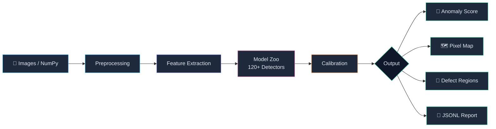
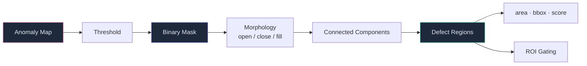

<p align="center">
  
</p>

<p align="center">
  <strong>Production-oriented visual anomaly detection for industrial inspection.</strong><br/>
  <sub>Image-level + Pixel-level · 120+ Models · Train → Deploy in one pipeline</sub>
</p>

<p align="center">
  <a href="https://pypi.org/project/pyimgano/"></a>
  <a href="https://pypi.org/project/pyimgano/"></a>
  <a href="https://github.com/skygazer42/pyimgano/actions/workflows/ci.yml"></a>
  <a href="https://github.com/skygazer42/pyimgano/blob/main/LICENSE"></a>
  <a href="https://github.com/psf/black"></a>
  <a href="https://pepy.tech/project/pyimgano"></a>
</p>

<p align="center">
  <a href="#-installation">Installation</a> •
  <a href="#-quickstart">Quickstart</a> •
  <a href="#-model-zoo">Model Zoo</a> •
  <a href="#-api-cheatsheet">API</a> •
  <a href="#-benchmarking">Benchmarking</a> •
  <a href="#-documentation">Docs</a> •
  <a href="#-citation">Citation</a>
</p>

<p align="center">
  <b>Start Here:</b> <a href="https://github.com/skygazer42/pyimgano/blob/main/docs/START_HERE.md">First-run guide</a> · <a href="https://github.com/skygazer42/pyimgano/blob/main/docs/STARTER_PATHS.md">Starter paths</a> · <a href="https://github.com/skygazer42/pyimgano/blob/main/docs/BENCHMARK_GETTING_STARTED.md">Benchmark starter guide</a> · <a href="https://github.com/skygazer42/pyimgano/blob/main/docs/CLI_REFERENCE.md">CLI reference</a> · <a href="https://github.com/skygazer42/pyimgano/blob/main/docs/ALGORITHM_SELECTION_GUIDE.md">Selection guide</a>
</p>

<p align="center">
  <b>Translations:</b> <a href="https://github.com/skygazer42/pyimgano/blob/main/README_cn.md">中文</a> · <a href="https://github.com/skygazer42/pyimgano/blob/main/README_ja.md">日本語</a> · <a href="https://github.com/skygazer42/pyimgano/blob/main/README_ko.md">한국어</a>
</p>

---

## Why pyimgano?

Most anomaly detection libraries target either **research** (maximizing paper metrics) or **tabular data** (PyOD-style). `pyimgano` bridges the gap for teams that need to go from algorithm selection to **production deployment** on real industrial images:

| | Research libs | Tabular AD (PyOD…) | **pyimgano** |
|---|---|---|---|
| Image-level scoring | ✓ | ✓ | ✓ |
| Pixel-level anomaly maps | ✓ | — | ✓ |
| Industrial IO (numpy, tiling, formats) | — | — | ✓ |
| Deploy bundles (ONNX / OpenVINO) | partial | — | ✓ |
| Reproducible CLI + audit trail | — | — | ✓ |
| 120+ unified model registry | — | ✓ | ✓ |
| Synthetic anomaly generation | — | — | ✓ |

---

## ✨ Key Features

<p align="center">
  
</p>

<table>
<tr>
<td width="50%">

**🧠 Unified Model Registry**
- 120+ registered entry points in a single `create_model()` call
- Classical (ECOD, KNN, IF, PCA…) + Deep (PatchCore, PaDiM, STFPM…) + VLM (WinCLIP, AnomalyDINO…)
- Lazy-loading registry — no heavy imports at startup

</td>
<td width="50%">

**🔍 Image + Pixel Anomaly Detection**
- Image-level anomaly scores
- Pixel-level anomaly maps with defect masks
- Connected-component regions with BBox and area
- ROI gating & binary morphology

</td>
</tr>
<tr>
<td>

**⚡ Production CLI Pipeline**
- `pyimgano-train` → `pyimgano-infer` → JSONL
- Reproducible runs with `report.json` + `per_image.jsonl`
- Deploy bundles for containers/servers
- Run comparison & leaderboard tables

</td>
<td>

**🚀 Deploy-ready Inference**
- Export to ONNX / OpenVINO / TorchScript
- Auditable `infer_config.json` + `calibration_card.json`
- High-resolution tiling for large images
- Explicit `ImageFormat` (RGB/BGR, U8/U16/F32, HWC/CHW)

</td>
</tr>
</table>

---

## 🏗️ Architecture

<p align="center">
  
</p>

<details>
<summary><b>Pipeline flow (Mermaid)</b></summary>



</details>

---

## 📦 Installation

```bash
pip install pyimgano
```

Task-oriented install aliases:

```bash
pip install "pyimgano[deploy]"       # train + infer + export deploy runtimes
pip install "pyimgano[benchmark]"    # benchmark-friendly vision extras
pip install "pyimgano[tracking]"     # tensorboard + wandb + mlflow tracking
pip install "pyimgano[cpu-offline]"  # richer CPU/offline-safe classical extras
```

<details>
<summary><b>Install from source (latest dev)</b></summary>

```bash
git clone https://github.com/skygazer42/pyimgano.git
cd pyimgano
pip install -e ".[dev]"
```

</details>

<details>
<summary><b>Optional extras</b></summary>

```bash
pip install "pyimgano[torch]"       # PyTorch deep backends + TorchScript export
pip install "pyimgano[onnx]"        # ONNX runtime
pip install "pyimgano[openvino]"    # OpenVINO runtime
pip install "pyimgano[deploy]"      # train + infer + export deploy bundle path
pip install "pyimgano[benchmark]"   # clip + skimage benchmark expansion
pip install "pyimgano[tracking]"    # tracking backends for workbench training
pip install "pyimgano[cpu-offline]" # skimage + numba CPU-first local workflows
pip install "pyimgano[skimage]"     # scikit-image baselines (SSIM/HOG/LBP/Gabor…)
pip install "pyimgano[numba]"       # Numba-accelerated baselines
pip install "pyimgano[viz]"         # matplotlib / seaborn plots
pip install "pyimgano[diffusion]"   # Diffusion-based methods
pip install "pyimgano[clip]"        # OpenCLIP backends
pip install "pyimgano[faiss]"       # Faster kNN for memory-bank methods
pip install "pyimgano[anomalib]"    # Anomalib checkpoint wrappers
pip install "pyimgano[backends]"    # clip + faiss + anomalib
pip install "pyimgano[all]"         # Everything
```

See `docs/OPTIONAL_DEPENDENCIES.md` for the full extras map.

</details>

<details>
<summary><b>Task-oriented install checks</b></summary>

```bash
pyimgano-doctor --profile deploy-smoke --json
pyimgano-doctor --recommend-extras --for-command export-onnx --json
pyimgano-doctor --recommend-extras --for-command benchmark --json
pyimgano-doctor --recommend-extras --for-command train --json
pyimgano-doctor --recommend-extras --for-command infer --json
pyimgano-doctor --recommend-extras --for-command runs --json
pyimgano-doctor --recommend-extras --for-model vision_openclip_patch_map --json
```

</details>

---

## 🚀 Quickstart

### Python API — 5 lines to detect

```python
from pyimgano.models import create_model

detector = create_model("vision_patchcore", device="cuda")
detector.fit(train_paths)                           # normal/reference images
scores = detector.decision_function(test_paths)     # anomaly scores
```

<details>
<summary><b>Classical baseline (CPU, no pixel maps)</b></summary>

```python
from pyimgano.models import create_model
from pyimgano.utils import ImagePreprocessor

extractor = ImagePreprocessor(resize=(224, 224), output_tensor=False)
detector = create_model("vision_ecod", feature_extractor=extractor, contamination=0.1, n_jobs=-1)

detector.fit(train_paths)
scores = detector.decision_function(test_paths)
labels, confidence = detector.predict(test_paths, return_confidence=True)
```

</details>

<details>
<summary><b>NumPy-first industrial inference</b></summary>

```python
import numpy as np
from pyimgano.inference import calibrate_threshold, infer
from pyimgano.inputs import ImageFormat

train_frames = [np.zeros((64, 64, 3), dtype=np.uint8) for _ in range(8)]
detector.fit(train_frames)
calibrate_threshold(detector, train_frames, input_format=ImageFormat.RGB_U8_HWC, quantile=0.995)

results = infer(detector, test_frames, input_format=ImageFormat.RGB_U8_HWC, include_maps=True)
print(results[0].score, results[0].label)
```

</details>

### CLI — End-to-end pipeline

```bash
# 1. Environment check + install hint
pyimgano-doctor --suite industrial-v4
pyimgano-doctor --recommend-extras --for-command export-onnx --json
python -m pyimgano --help

# 2. Quick smoke demo (creates dataset + runs a bounded suite + prints next steps)
pyimgano-demo --smoke --summary-json /tmp/pyimgano_demo_summary.json --emit-next-steps

# 3. Train → export infer config
pyimgano-train \
  --config examples/configs/industrial_adapt_defects_fp40.json \
  --export-infer-config

# 4. Inference → JSONL + defect masks
pyimgano-infer \
  --infer-config /path/to/run_dir/artifacts/infer_config.json \
  --input /path/to/images \
  --defects \
  --save-masks /tmp/pyimgano_masks \
  --save-jsonl /tmp/pyimgano_results.jsonl
```

The JSONL output carries stable deployment metadata for downstream systems, including
`decision_summary` on each success record and `postprocess_summary` whenever runtime
postprocess / infer-config defaults are in play; Python best-effort batch integrations
also receive a `triage_summary` aggregate from `run_continue_on_error_inference(...)`.

If you want benchmark presets with the lowest setup friction first, start from:

```bash
pyimgano benchmark --list-starter-configs
pyimgano benchmark --starter-config-info official_mvtec_industrial_v4_cpu_offline.json --json
```

### Guided Workflow

If you want one compact command chain to follow:

- `Discover`:
  `pyim --list models --objective latency --selection-profile cpu-screening --topk 5`
  Or use the task-oriented shortcut: `pyim --goal first-run --json`
- `Benchmark`:
  `pyimgano-doctor --recommend-extras --for-command benchmark --json`
- `Train`:
  `pyimgano-doctor --recommend-extras --for-command train --json`
  Inspect recipes first with:
  `pyimgano train --list-recipes`
  `pyimgano train --recipe-info industrial-adapt --json`
- `Export`:
  `pyimgano-doctor --recommend-extras --for-command export-onnx --json`
- `Infer`:
  `pyimgano-doctor --recommend-extras --for-command infer --json`
- `Validate`:
  `pyimgano validate-infer-config runs/<run_dir>/deploy_bundle/infer_config.json`
- `Gate`:
  `pyimgano-doctor --recommend-extras --for-command runs --json`

<details>
<summary><b>One-off inference (no workbench)</b></summary>

```bash
pyimgano-infer \
  --model vision_patchcore \
  --preset industrial-balanced \
  --device cuda \
  --train-dir /path/to/normal/train_images \
  --calibration-quantile 0.995 \
  --input /path/to/images \
  --include-maps
```

Pass extra kwargs via `--model-kwargs '{"backbone":"wide_resnet50","coreset_sampling_ratio":0.1}'`.

</details>

<details>
<summary><b>Model discovery</b></summary>

```bash
pyimgano --list models
pyimgano list models
pyimgano -- list models --json
pyimgano --list models --family patchcore
pyimgano --list preprocessing --deployable-only
pyim --list models
pyim --list models --family patchcore
pyim --list models --year 2021 --type deep-vision
pyim --list models --type flow-based
pyim --list preprocessing --deployable-only
```

`pyimgano` is now the umbrella CLI. `pyimgano list ...` and `pyimgano -- list ...`
map to the same discovery flow as `pyimgano --list ...`. `pyim` remains the
shorter discovery alias.

</details>

### Shortest audited operator path

If you want the shortest “train -> validate -> gate” path for production-style
handoff, the root CLI now exposes it directly:

```bash
pyimgano --help
pyimgano -- list preprocessing --deployable-only
pyimgano train --list-recipes
pyimgano train --recipe-info industrial-adapt --json
pyimgano train --dry-run --config examples/configs/industrial_adapt_audited.json
pyimgano train --config examples/configs/industrial_adapt_audited.json --export-infer-config --export-deploy-bundle
pyimgano validate-infer-config runs/<run_dir>/deploy_bundle/infer_config.json
pyimgano-bundle validate runs/<run_dir>/deploy_bundle --json
pyimgano-bundle watch runs/<run_dir>/deploy_bundle --watch-dir /path/to/inbox --output-dir ./bundle_watch --once --json
pyimgano runs quality runs/<run_dir> --require-status audited --json
pyimgano runs acceptance runs/<run_dir> --require-status audited --check-bundle-hashes --json
pyimgano weights audit-bundle runs/<run_dir>/deploy_bundle --check-hashes --json
```

That flow uses the checked-in
[`industrial_adapt_audited.json`](https://github.com/skygazer42/pyimgano/blob/main/examples/configs/industrial_adapt_audited.json)
example and is described in more detail in
[`docs/INDUSTRIAL_FASTPATH.md`](https://github.com/skygazer42/pyimgano/blob/main/docs/INDUSTRIAL_FASTPATH.md).
New deploy bundles also include `handoff_report.json`, a compact operator-facing
summary next to `infer_config.json` and `bundle_manifest.json`.
For hot-folder deployment, `pyimgano-bundle watch ...` turns the same deploy bundle
into a polling runtime that appends `results.jsonl`, `watch_events.jsonl`, and
`watch_state.json` under one output directory. A minimal containerized example is
included in [`Dockerfile.bundle-watch`](https://github.com/skygazer42/pyimgano/blob/main/Dockerfile.bundle-watch) and
[`compose.bundle-watch.yml`](https://github.com/skygazer42/pyimgano/blob/main/compose.bundle-watch.yml).
When you want a downstream system callback without adding MQTT or RTSP yet, pass
`--webhook-url https://example.internal/qc-hook`; successful watch records are
POSTed as JSON, and failed deliveries are retried on later polling cycles without
rerunning inference for the same fingerprint. For auth and plant-specific routing,
you can add `--webhook-bearer-token ...` and repeat `--webhook-header KEY=VALUE`.
If the receiver needs tamper checking, add `--webhook-signing-secret ...`; the
request then carries `X-PyImgAno-Timestamp` and `X-PyImgAno-Signature`
(`HMAC-SHA256` over `<timestamp>.<raw_json_body>`).
For container/runtime deployments, you can also resolve secrets from env vars via
`--webhook-bearer-token-env ...` and `--webhook-signing-secret-env ...`.
If your runtime mounts secrets as files instead, use
`--webhook-bearer-token-file ...` and `--webhook-signing-secret-file ...`.
Webhook payloads now also carry `delivery_id` and `delivery_attempt`, and the same
values are mirrored into `X-PyImgAno-Delivery-Id` / `X-PyImgAno-Delivery-Attempt`
headers so downstream systems can dedupe retries safely.
If a receiver outage would make per-poll retries too noisy, add
`--webhook-retry-min-seconds ...` to enforce a minimum delay before retrying the
same failed delivery.
When backoff is active, failed entries now record `next_delivery_attempt_after`
and `watch_report.json` includes a `delivery_summary.pending_retry` count so operators
can see why a retry was deferred.
The same report also surfaces `next_delivery_attempt_after_min` so dashboards or
plain-text operators can see the earliest retry horizon without scanning the full state file.
For faster triage, `watch_report.json` now also carries the latest aggregated
`last_delivery_error` and `last_delivery_error_path`.
It also carries `last_delivery_success_path` and `last_delivery_success_at`, so the
same report shows the latest successful webhook handoff alongside the latest failure.

For reproducible benchmark reporting, pair that operator loop with the built-in
official preset discovery and publication gate:

```bash
pyimgano benchmark --list-official-configs
pyimgano benchmark --official-config-info official_mvtec_industrial_v4_cpu_offline.json --json
pyimgano runs acceptance /path/to/suite_export --json
pyimgano runs publication /path/to/suite_export --json
```

That keeps the shortest industrial fast-path and the publication path visible
from the same umbrella CLI entrypoint.

If your deploy bundle carries `model_card.json` and `weights_manifest.json`,
`pyimgano weights audit-bundle ...` gives you a single delivery gate for both.
If you want one aggregated release check instead of calling the low-level
validators individually, use `pyimgano runs acceptance ...`; it now auto-routes
run directories and suite publication exports through the matching gate.
For suite exports, the publication gate now also enforces benchmark provenance
(`benchmark_config.source` + `sha256`), `evaluation_contract`, and `citation`
instead of trusting a manually stamped `publication_ready=true`.
It also expects audit refs back to `report.json`, `config.json`, and
`environment.json`, plus matching sha256 digests for those files, so exported
leaderboards remain traceable to the saved run. The exported leaderboard tables
themselves now carry recorded sha256 digests too, so `leaderboard.csv`,
`best_by_baseline.csv`, `skipped.csv` (and markdown variants when exported)
are verified before a suite export is treated as publication-ready.

---

## 🧠 Model Zoo

`pyimgano` ships **120+ registered model entry points** spanning classical statistics to modern vision-language models.

### Algorithm Capability Matrix

<p align="center">
  
</p>

### Recommended Baselines

| Goal | Model | Tags | Notes |
|:-----|:------|:-----|:------|
| 🎯 Strong pixel localization | `vision_patchcore` | `numpy,pixel_map` | Best default for MVTec/VisA-style data |
| 🛡️ Robust to noisy normals | `vision_softpatch` | `numpy,pixel_map` | Filters outlier patches in memory bank |
| 🪶 Lightweight pixel baseline | `vision_padim` / `vision_spade` | `numpy,pixel_map` | Simpler, easier to tune |
| 📸 Few-shot / small normal set | `vision_anomalydino` | `numpy,pixel_map` | DINOv2-based, downloads weights on first run |
| 💻 CPU-only / precomputed | `vision_ecod` / `vision_copod` | `classical` | Fast, parameter-free, score-only |
| 🔌 Anomalib integration | `vision_*_anomalib` | `deep` | Requires `pyimgano[anomalib]` |

<details>
<summary><b>Full algorithm taxonomy</b></summary>

| Category | Type | Algorithms | Count |
|:---------|:-----|:-----------|------:|
| **Statistical** | Density / Distribution | ECOD, COPOD, HBOS, KDE, GMM, MCD, QMCD | 24 |
| **Proximity** | Neighbor-based | KNN, LOF, COF, LDOF, ODIN, INNE, LoOP | 18 |
| **Subspace** | Projection | PCA, KPCA, SOD, ROD, LODA | 8 |
| **Tree / Graph** | Isolation | Isolation Forest, RRCF, HST, MST, R-Graph | 10 |
| **Ensemble** | Multi-detector | Feature Bagging, LSCP, SUOD, Score Ensemble | 6 |
| **Memory Bank** | Patch-based deep | PatchCore, PaDiM, SPADE, SoftPatch, MemSeg | 12 |
| **Student-Teacher** | Knowledge distill | STFPM, Reverse Distillation, EfficientAD, AST | 8 |
| **Flow-based** | Normalizing flows | FastFlow, CFlow, CS-Flow | 6 |
| **Reconstruction** | AE / VAE | AE, VAE, VQ-VAE, DRAEM, DFM | 10 |
| **VLM / Zero-shot** | Vision-Language | WinCLIP, AnomalyDINO, PromptAD | 6 |
| **Template** | Pixel statistics | SSIM, NCC, Phase correlation, Pixel Gaussian | 8 |
| **Industrial** | Pipeline wrappers | ResNet18, ONNX, TorchScript pipelines | 14+ |

</details>

> 📖 See `docs/ALGORITHM_SELECTION_GUIDE.md` for a detailed decision flowchart.

---

## 📋 API Cheatsheet

```python
from pyimgano.models import create_model, list_models

# ╭──────────────────────────────────────────────╮
# │  Discovery                                   │
# ╰──────────────────────────────────────────────╯
list_models()                              # all registered names
list_models(tags=["vision", "pixel_map"])  # filter by tags

# ╭──────────────────────────────────────────────╮
# │  Core detector API                           │
# ╰──────────────────────────────────────────────╯
detector = create_model("vision_patchcore", device="cuda", contamination=0.1)

detector.fit(X_train)                      # train on normal images
scores = detector.decision_function(X)     # → np.ndarray of anomaly scores
labels = detector.predict(X)               # → 0 (normal) / 1 (anomaly)
labels, conf = detector.predict(X, return_confidence=True)

# ╭──────────────────────────────────────────────╮
# │  Pixel-level (models with pixel_map tag)     │
# ╰──────────────────────────────────────────────╯
anomaly_map = detector.predict_anomaly_map(image)  # → H×W float array

# ╭──────────────────────────────────────────────╮
# │  Industrial inference                        │
# ╰──────────────────────────────────────────────╯
from pyimgano.inference import infer, calibrate_threshold
from pyimgano.inputs import ImageFormat

calibrate_threshold(detector, X_train, input_format=ImageFormat.RGB_U8_HWC, quantile=0.995)
results = infer(detector, X_test, input_format=ImageFormat.RGB_U8_HWC, include_maps=True)
# results[i].score, results[i].label, results[i].anomaly_map

# ╭──────────────────────────────────────────────╮
# │  Evaluation                                  │
# ╰──────────────────────────────────────────────╯
from pyimgano import evaluate_detector, compute_auroc

metrics = evaluate_detector(detector, X_test, y_test)  # full report
auroc = compute_auroc(y_true, scores)                   # single metric
```

---

## 📊 Benchmarking

Run curated **baseline suites** with a single command and get aggregated leaderboard tables:

```bash
# Discover suites
pyimgano-benchmark --list-suites
pyimgano-benchmark --suite-info industrial-v4 --json

# Run a suite
pyimgano-benchmark \
  --dataset mvtec --root /path/to/mvtec_ad --category bottle \
  --suite industrial-v4 --device cpu --no-pretrained \
  --suite-export both --output-dir /tmp/suite_run

# Optional: small grid search
pyimgano-benchmark \
  --dataset mvtec --root /path/to/mvtec_ad --category bottle \
  --suite industrial-v4 --suite-sweep industrial-template-small \
  --suite-sweep-max-variants 1 --suite-export csv \
  --output-dir /tmp/suite_sweep
```

<details>
<summary><b>Run comparison</b></summary>

```bash
pyimgano-runs list --root runs
pyimgano-runs list --root runs --kind robustness --same-robustness-protocol-as runs/run_a --json
pyimgano-runs compare runs/run_a runs/run_b --json
pyimgano-runs compare runs/run_a runs/run_b --baseline runs/run_a --require-same-split --json
pyimgano-runs compare runs/run_a runs/run_b --baseline runs/run_a --require-same-robustness-protocol --json
pyimgano-runs acceptance /path/to/suite_export --json
pyimgano-runs publication /path/to/suite_export --json
```

`pyimgano-runs compare` now surfaces dataset readiness in both JSON and plain
text: baseline summaries expose `baseline_dataset_readiness`,
candidate summaries expose `candidate_dataset_readiness`, plain briefs include
`dataset_readiness=...`, and shell-friendly compare logs print
`baseline_dataset_readiness_status=...`,
`candidate_dataset_readiness_status.<run>=...`, and `dataset_issue_codes=...`
when those signals exist.

</details>

> Some suite entries are **optional** and are skipped if extras are missing (with hints like `pip install 'pyimgano[torch]'`).
> For reproducible publications, use built-in official presets via `--config official_mvtec_industrial_v4_cpu_offline.json`.

---

## 🎨 Synthetic Anomaly Generation

When real defects are scarce, generate controlled synthetic anomalies for smoke tests, robustness checks, and pixel-mask pipelines:

```bash
pyimgano-synthesize \
  --in-dir /path/to/normal_images \
  --out-root ./out_synth_dataset \
  --category synthetic_demo \
  --presets scratch stain tape edge_wear \
  --roi-mask /path/to/roi_mask.png \
  --blend alpha --alpha 0.9 \
  --n-train 50 --n-test-normal 20 --n-test-anomaly 20 \
  --seed 0
```

Supported presets: `scratch` · `stain` · `tape` · `edge_wear` · Perlin noise · CutPaste · custom

> 📖 Guide: `docs/SYNTHETIC_ANOMALY_GENERATION.md`

---

## 🏭 Industrial Outputs (Defects)

When `--defects` is enabled, `pyimgano-infer` derives structured defect information from the anomaly map:



- **Binary defect mask** — optional artifact output
- **Connected-component regions** — area, bbox, per-region score
- **ROI gating** — only flag defects inside the region of interest
- **Morphology** — open/close/fill holes to reduce noise
- **Stable triage metadata** — per-record `decision_summary` for review routing and low-confidence rejection handling
- **Stable runtime metadata** — per-record `postprocess_summary` for map/postprocess/threshold provenance

> 📖 Guides: `docs/INDUSTRIAL_INFERENCE.md` · `docs/FALSE_POSITIVE_DEBUGGING.md`

---

## 🔧 CLI Reference

| Command | Purpose |
|:--------|:--------|
| `pyimgano` | Top-level umbrella CLI (`pyimgano --help`, `pyimgano list models`) |
| `pyimgano-demo` | Quick end-to-end demo |
| `pyimgano-doctor` | Environment & dependency check |
| `pyimgano-train` | Train + export `infer_config.json` |
| `pyimgano-infer` | Inference → JSONL + masks |
| `pyimgano-benchmark` | Suite / sweep benchmarking |
| `pyimgano-synthesize` | Synthetic anomaly generation |
| `pyimgano-runs` | Run listing & comparison |
| `pyimgano-weights` | Weight manifest & model cards |
| `pyimgano-features` | Feature extraction utilities |
| `pyimgano-datasets` | Dataset management |
| `pyimgano-defects` | Defect post-processing |
| `pyim` | Unified discovery (`pyim --list models`) |

> 📖 Full reference: `docs/CLI_REFERENCE.md`

`pyimgano-runs quality`, `pyimgano-runs acceptance`, and `pyimgano-runs publication` now expose structured
trust metadata as well:

- `trust_summary` for saved run artifacts
- `trust_signals` for suite publication bundles

This makes it easier to gate CI/release automation on auditable machine-readable
signals instead of parsing free-form warnings.

---

## ⚖️ Weights & Cache Policy

- `pyimgano` does **not** ship model weights inside the wheel.
- Weights are cached by upstream libraries (torchvision / OpenCLIP / HuggingFace).
- Set cache env vars on servers: `TORCH_HOME`, `HF_HOME`, `XDG_CACHE_HOME`

```bash
# Auditable weight management
pyimgano-weights template manifest > ./weights_manifest.json
pyimgano-weights validate ./weights_manifest.json --check-files --json
```

---

## 📚 Documentation

<table>
<tr>
<td width="33%">

**Getting Started**
- [`START_HERE.md`](https://github.com/skygazer42/pyimgano/blob/main/docs/START_HERE.md)
- [`BENCHMARK_GETTING_STARTED.md`](https://github.com/skygazer42/pyimgano/blob/main/docs/BENCHMARK_GETTING_STARTED.md)
- [`QUICKSTART.md`](https://github.com/skygazer42/pyimgano/blob/main/docs/QUICKSTART.md)
- [`WORKBENCH.md`](https://github.com/skygazer42/pyimgano/blob/main/docs/WORKBENCH.md)
- [`CLI_REFERENCE.md`](https://github.com/skygazer42/pyimgano/blob/main/docs/CLI_REFERENCE.md)
- [`STABILITY.md`](https://github.com/skygazer42/pyimgano/blob/main/docs/STABILITY.md)

</td>
<td width="33%">

**Industrial / Production**
- [`INDUSTRIAL_INFERENCE.md`](https://github.com/skygazer42/pyimgano/blob/main/docs/INDUSTRIAL_INFERENCE.md)
- [`INDUSTRIAL_FASTPATH.md`](https://github.com/skygazer42/pyimgano/blob/main/docs/INDUSTRIAL_FASTPATH.md)
- Example config: [`industrial_adapt_audited.json`](https://github.com/skygazer42/pyimgano/blob/main/examples/configs/industrial_adapt_audited.json)
- [`ROBUSTNESS_BENCHMARK.md`](https://github.com/skygazer42/pyimgano/blob/main/docs/ROBUSTNESS_BENCHMARK.md)
- [`FALSE_POSITIVE_DEBUGGING.md`](https://github.com/skygazer42/pyimgano/blob/main/docs/FALSE_POSITIVE_DEBUGGING.md)

</td>
<td width="33%">

**Reference**
- [`MODEL_INDEX.md`](https://github.com/skygazer42/pyimgano/blob/main/docs/MODEL_INDEX.md)
- [`ALGORITHM_SELECTION_GUIDE.md`](https://github.com/skygazer42/pyimgano/blob/main/docs/ALGORITHM_SELECTION_GUIDE.md)
- [`EVALUATION_AND_BENCHMARK.md`](https://github.com/skygazer42/pyimgano/blob/main/docs/EVALUATION_AND_BENCHMARK.md)
- [`PUBLISHING.md`](https://github.com/skygazer42/pyimgano/blob/main/docs/PUBLISHING.md)
- [`examples/README.md`](https://github.com/skygazer42/pyimgano/blob/main/examples/README.md)

</td>
</tr>
</table>

---

## 🤝 Contributing

We welcome contributions! Please see:

- [`CONTRIBUTING.md`](https://github.com/skygazer42/pyimgano/blob/main/CONTRIBUTING.md) — development workflow
- [`CODE_OF_CONDUCT.md`](https://github.com/skygazer42/pyimgano/blob/main/CODE_OF_CONDUCT.md)
- [`SECURITY.md`](https://github.com/skygazer42/pyimgano/blob/main/SECURITY.md)

---

## 📄 License

[MIT](https://github.com/skygazer42/pyimgano/blob/main/LICENSE)

---

## 📝 Citation

GitHub citation metadata is provided via [`CITATION.cff`](https://github.com/skygazer42/pyimgano/blob/main/CITATION.cff).

```bibtex
@software{pyimgano2026,
  author    = {PyImgAno Contributors},
  title     = {pyimgano: Production-oriented Visual Anomaly Detection},
  year      = {2026},
  url       = {https://github.com/skygazer42/pyimgano}
}
```

---

<p align="center">
  <sub>Made with care for industrial inspection teams.</sub><br/>
  <a href="https://github.com/skygazer42/pyimgano">⭐ Star us on GitHub</a>
</p>
