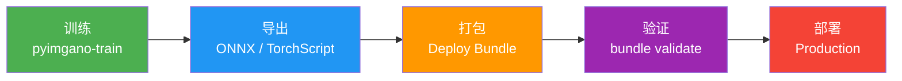

# 部署概览

=== "中文"

    pyimgano 提供完整的模型部署流水线——从训练完成到生产环境上线，每一步都有工具支撑和验证机制。

=== "English"

    pyimgano provides a complete model deployment pipeline — from training completion to production rollout, with tooling and validation at every step.

## 部署流程

## 子章节

| 章节 | 说明 |
|------|------|
| [模型导出](export.md) | ONNX、TorchScript、OpenVINO 导出指南 |
| [部署包](bundle.md) | Deploy Bundle 的创建、验证与运行 |
| [工业快速路径](industrial.md) | 一份配置 → 一次运行 → 可审计产物集 |

!!! tip "快速开始"

    如果你的目标是最快速地从训练到部署，请直接参阅 [工业快速路径](industrial.md)。
