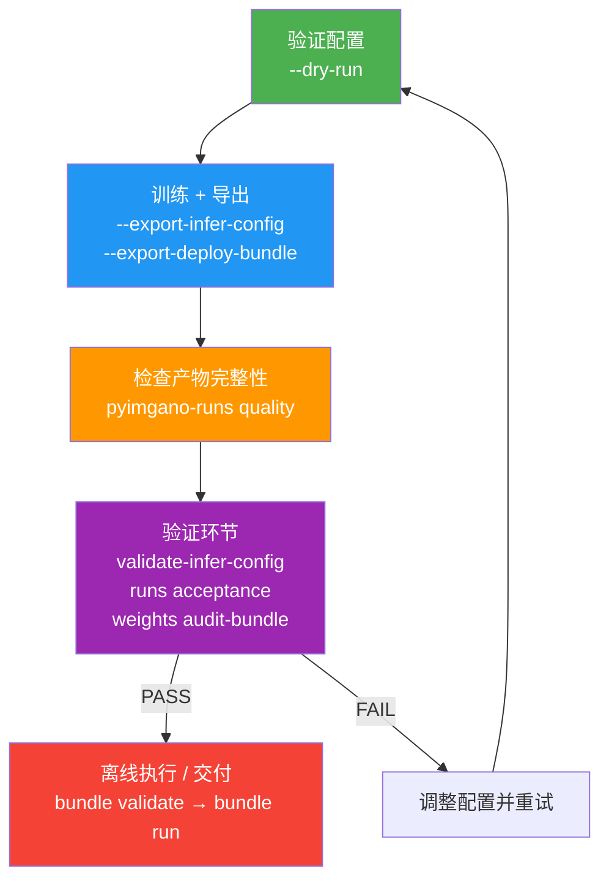

# 工业快速路径

=== "中文"

    工业快速路径（Industrial Fast-Path）是从工作台配置到可部署推理包的最短审计路径。目标：**一份配置 → 一次运行 → 可审计的产物集**。

=== "English"

    The Industrial Fast-Path is the shortest audited route from a workbench config to a deployable inference bundle. Goal: **one config → one run → audited artifact set**.

## 流程总览



## 产物集

=== "中文"

    一次完整运行会产出以下产物。每个文件都有明确的审计用途。

=== "English"

    A complete run produces the following artifacts. Each file serves a specific audit purpose.

| 产物 | 路径 | 说明 |
|------|------|------|
| `report.json` | `<run_dir>/report.json` | 训练报告：指标摘要、数据集统计、超参数 |
| `config.json` | `<run_dir>/config.json` | 训练时使用的完整配置快照 |
| `environment.json` | `<run_dir>/environment.json` | 运行环境信息 |
| `infer_config.json` | `<run_dir>/artifacts/infer_config.json` | 推理配置：阈值、阈值来源、分片元数据 |
| `calibration_card.json` | `<run_dir>/artifacts/calibration_card.json` | 校准审计卡：阈值校准上下文 |
| `bundle_manifest.json` | `<run_dir>/deploy_bundle/bundle_manifest.json` | 包清单：文件列表、路径、大小、SHA256 摘要 |
| `handoff_report.json` | `<run_dir>/deploy_bundle/handoff_report.json` | 交付报告：操作员视角的 bundle 摘要 |

## 推荐起始配置

```bash
# 使用工业审计模板
pyimgano-train --config examples/configs/industrial_adapt_audited.json
```

=== "中文"

    `industrial_adapt_audited.json` 针对审计导出路径调优，包含以下关键设定：

=== "English"

    `industrial_adapt_audited.json` is tuned for the audited export path with these key settings:

- `output.save_run=true` — 持久化运行记录
- `training.enabled=true` — 生成可导出的 checkpoint
- `adaptation.save_maps=true` — 保存 map 产物供审查
- `defects.pixel_threshold` 固定 — 使 `--export-deploy-bundle` 自包含

!!! tip "配方发现"

    ```bash
    pyimgano train --list-recipes
    pyimgano train --recipe-info industrial-adapt --json
    ```

## 步骤详解

### 1. 验证配置

```bash
pyimgano-train --config examples/configs/industrial_adapt_audited.json --dry-run
```

### 2. 训练并导出推理配置

```bash
pyimgano-train \
    --config examples/configs/industrial_adapt_audited.json \
    --export-infer-config
```

### 3. 导出部署包

```bash
pyimgano-train \
    --config examples/configs/industrial_adapt_audited.json \
    --export-deploy-bundle
```

### 4. 检查产物完整性

```bash
pyimgano-runs quality /path/to/run_dir --json
```

## 产物审查要点

### `artifacts/infer_config.json`

=== "中文"

    推理端有效载荷，供 `pyimgano-infer` 使用。包含阈值及阈值来源（provenance），在可用时携带分片元数据。

=== "English"

    Inference-facing payload for `pyimgano-infer`. Includes threshold and threshold provenance, carries split metadata when available.

### `artifacts/calibration_card.json`

=== "中文"

    紧凑的阈值审计卡，记录导出阈值背后的校准上下文。必须内容有效（不仅仅是文件存在），`pyimgano-runs quality` 才会将运行报告为 `audited` 状态。

=== "English"

    Compact threshold-audit card recording the calibration context behind the exported threshold. Must be valid (not just present) for `pyimgano-runs quality` to report an `audited` run.

### `deploy_bundle/bundle_manifest.json`

=== "中文"

    列出所有打包文件，记录相对路径、文件大小和 SHA256 摘要。用于发布交付时的机器验证。

=== "English"

    Lists every bundled file, captures relative paths, sizes, and SHA256 digests. Intended for machine verification during release handoff.

### `deploy_bundle/handoff_report.json`

=== "中文"

    面向操作员的 bundle 交付摘要，映射部署验证所需的关键引用，帮助下游自动化区分缺失与无效的交付元数据。

=== "English"

    Compact operator-facing summary of the bundle handoff. Mirrors expected key refs for deploy validation, helping downstream automation distinguish missing vs. invalid handoff metadata.

## 验证环节

=== "中文"

    导出完成后，最小审计检查流程如下：

=== "English"

    After export, the minimal audited verification loop:

```bash
# 质量检查：要求 audited 状态
pyimgano-runs quality /path/to/run_dir --require-status audited --json

# 推理配置验证
pyimgano-validate-infer-config /path/to/run_dir/deploy_bundle/infer_config.json

# 验收检查：验证 bundle 哈希
pyimgano-runs acceptance /path/to/run_dir --require-status audited --check-bundle-hashes --json
```

=== "中文"

    如果 deploy bundle 还包含 `model_card.json` 和 `weights_manifest.json`，需追加权重审计：

=== "English"

    If the deploy bundle also carries `model_card.json` and `weights_manifest.json`, add weight auditing:

```bash
pyimgano-weights audit-bundle /path/to/run_dir/deploy_bundle --check-hashes --json
```

!!! note "套件导出"

    对于套件导出交付（而非单次运行），同样使用 acceptance 入口：

    ```bash
    pyimgano-runs acceptance /path/to/suite_export --json
    ```

## 离线 Bundle 执行

=== "中文"

    bundle 导出并通过验收后，可作为固定的离线 QC 包进行验证和执行。

=== "English"

    Once the bundle is exported and accepted, it can be validated and executed as a fixed offline QC package.

```bash
# 验证 bundle
pyimgano bundle validate /path/to/run_dir/deploy_bundle --json

# 运行 bundle
pyimgano bundle run /path/to/run_dir/deploy_bundle \
    --image-dir /path/to/lot_images \
    --output-dir ./bundle_run \
    --max-anomaly-rate 0.05 \
    --max-reject-rate 0.02 \
    --max-error-rate 0.00 \
    --min-processed 100 \
    --json
```

### 输出约定

| 输出 | 路径 | 说明 |
|------|------|------|
| `results.jsonl` | `<output_dir>/results.jsonl` | 逐图推理结果 |
| `run_report.json` | `<output_dir>/run_report.json` | 运行报告（含 `batch_verdict`、`batch_gate_summary`、`batch_gate_reason_codes`、输出摘要） |
| 异常掩码 | `<output_dir>/masks/` | 像素级输出（受 bundle 约定门控） |
| 叠加可视化 | `<output_dir>/overlays/` | 像素级输出（受 bundle 约定门控） |
| 缺陷区域 | `<output_dir>/defects_regions.jsonl` | 像素级输出（受 bundle 约定门控） |

### deployable 状态

=== "中文"

    当 `pyimgano-runs quality` 报告 `deployable` 时，表示运行具有完整的审计产物集（`infer_config.json`、`calibration_card.json`、`bundle_manifest.json`）。如果 bundle 还包含 `model_card.json` 或 `weights_manifest.json`，这些文件也必须通过验证，运行才能保持 `deployable` 状态。

=== "English"

    When `pyimgano-runs quality` reports `deployable`, the run has the full audited artifact set (`infer_config.json`, `calibration_card.json`, `bundle_manifest.json`). If the bundle also carries `model_card.json` or `weights_manifest.json`, those must validate as well to maintain `deployable` status.

!!! info "更多信息"

    字段级审查清单请参阅项目中的 `docs/CALIBRATION_AUDIT.md`。

## 部署清单

!!! abstract "上线前检查"

    - [ ] `pyimgano-train --dry-run` 通过
    - [ ] 训练完成，产物集完整（7 个核心文件）
    - [ ] `pyimgano-runs quality --require-status audited` 通过
    - [ ] `pyimgano-validate-infer-config` 通过
    - [ ] `pyimgano-runs acceptance --check-bundle-hashes` 通过
    - [ ] `pyimgano-weights audit-bundle --check-hashes` 通过（如有 model_card/weights_manifest）
    - [ ] `pyimgano bundle validate` 通过
    - [ ] 在目标硬件上完成 `pyimgano bundle run` 测试
    - [ ] `batch_verdict` 为 `PASS`
