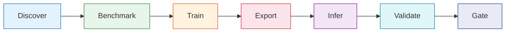

# 首次运行

=== "中文"

    本页面提供从环境检查到部署验证的完整引导路径。如果你已完成 [5 分钟体验](quickstart.md)，
    可以按照下方路径逐步操作。

=== "English"

    This page provides a guided path from environment check to deployment validation.
    If you have completed the [Quickstart](quickstart.md), follow the paths below.

---

## 入口命令

```bash
pyimgano --help
```

=== "中文"

    `pyimgano --help` 是所有 CLI 命令的入口。输出包含 discover / benchmark / train / infer / validate / gate 六个阶段的分组命令索引。

=== "English"

    `pyimgano --help` is the entry point for all CLI commands. The output includes a grouped command index organized into discover / benchmark / train / infer / validate / gate stages.

---

## 部署冒烟路径

!!! tip "推荐首选"

    这是从零到部署包验证的**最短离线安全路径**。

```bash
# 1. 环境检查
pyimgano-doctor --profile deploy-smoke --json

# 2. 创建演示数据集 + 运行基线
pyimgano-demo --smoke \
  --dataset-root ./_demo_custom_dataset \
  --output-dir ./_demo_suite_run \
  --summary-json /tmp/pyimgano_demo_summary.json \
  --emit-next-steps \
  --no-pretrained

# 3. 训练 + 导出 Deploy Bundle
pyimgano-train \
  --config examples/configs/deploy_smoke_custom_cpu.json \
  --root ./_demo_custom_dataset \
  --export-infer-config \
  --export-deploy-bundle

# 4. 验证部署产物
pyimgano validate-infer-config runs/<run_dir>/deploy_bundle/infer_config.json
pyimgano bundle validate runs/<run_dir>/deploy_bundle --json

# 5. 质量门禁
pyimgano runs quality runs/<run_dir> --json
```

=== "中文"

    每一步的作用：

    - `pyimgano-doctor --profile deploy-smoke` 验证最小离线安全路径所需的依赖
    - `pyimgano-demo --smoke` 创建小型数据集并运行基线检测
    - `pyimgano-train` 完成 CPU 安全的训练，导出 `infer_config.json` 和 Deploy Bundle
    - `validate-infer-config` 和 `bundle validate` 在执行大规模基准测试前验证部署产物
    - `runs quality` 检查运行目录的质量门禁

=== "English"

    What each step does:

    - `pyimgano-doctor --profile deploy-smoke` validates dependencies for the smallest offline-safe path
    - `pyimgano-demo --smoke` creates a small dataset and runs baseline detection
    - `pyimgano-train` performs CPU-safe training, exports `infer_config.json` and a Deploy Bundle
    - `validate-infer-config` and `bundle validate` verify deployment artifacts before larger benchmarks
    - `runs quality` checks the run directory against quality gates

---

## 前 10 分钟路径

```bash
# 1. 环境检查
pyimgano-doctor --profile first-run --json

# 2. 演示数据集
pyimgano-demo --smoke \
  --dataset-root ./_demo_custom_dataset \
  --output-dir ./_demo_suite_run \
  --summary-json /tmp/pyimgano_demo_summary.json \
  --emit-next-steps \
  --no-pretrained

# 3. 基准就绪检查
pyimgano-doctor --profile benchmark \
  --dataset-target ./_demo_custom_dataset --json

# 4. 基准测试
pyimgano-benchmark \
  --dataset custom \
  --root ./_demo_custom_dataset \
  --suite industrial-ci \
  --resize 32 32 \
  --limit-train 2 --limit-test 2 \
  --no-pretrained \
  --save-run \
  --output-dir ./_demo_benchmark_run \
  --suite-export csv

# 5. 推理
pyimgano-infer \
  --model-preset industrial-template-ncc-map \
  --train-dir ./_demo_custom_dataset/train/normal \
  --input ./_demo_custom_dataset/test \
  --save-jsonl ./_demo_results.jsonl

# 6. 质量门禁
pyimgano runs quality ./_demo_benchmark_run --json
```

---

## 引导式工作流

=== "中文"

    pyimgano 的 CLI 按七个阶段组织。每个阶段都有对应的 `pyimgano-doctor` profile 和推荐命令。

=== "English"

    The pyimgano CLI is organized into seven stages. Each stage has a corresponding `pyimgano-doctor` profile and recommended commands.

### 阶段概览



### Discover — 模型发现

```bash
pyim --list models --objective latency --selection-profile cpu-screening --topk 5
```

=== "中文"

    按延迟、精度等目标筛选模型。`--selection-profile cpu-screening` 过滤出 CPU 友好的候选模型。

=== "English"

    Filter models by latency, accuracy, and other objectives. `--selection-profile cpu-screening` selects CPU-friendly candidates.

### Benchmark — 基准测试

```bash
pyimgano-doctor --recommend-extras --for-command benchmark --json
pyimgano benchmark --list-starter-configs
pyimgano-benchmark --config official_mvtec_industrial_v4_cpu_offline.json
```

### Train — 训练

```bash
pyimgano-doctor --recommend-extras --for-command train --json
pyimgano-train --config <your_config.json> --root /path/to/dataset
```

### Export — 导出

```bash
pyimgano-doctor --recommend-extras --for-command export-onnx --json
```

### Infer — 推理

```bash
pyimgano-doctor --recommend-extras --for-command infer --json
pyimgano-infer --model-preset <preset> --train-dir /path/to/train --input /path/to/test
```

### Validate — 验证

```bash
pyimgano validate-infer-config runs/<run_dir>/deploy_bundle/infer_config.json
pyimgano bundle validate runs/<run_dir>/deploy_bundle --json
```

### Gate — 门禁

```bash
pyimgano-doctor --recommend-extras --for-command runs --json
pyimgano runs quality runs/<run_dir> --json
pyimgano runs acceptance runs/<run_dir> --require-status audited --check-bundle-hashes --json
```

---

## pyimgano-doctor 环境 Profile

| Profile | 命令 | 用途 |
|---------|------|------|
| `deploy-smoke` | `pyimgano-doctor --profile deploy-smoke --json` | 最小部署路径依赖检查 |
| `first-run` | `pyimgano-doctor --profile first-run --json` | 基础离线启动路径检查 |
| `benchmark` | `pyimgano-doctor --profile benchmark --dataset-target <path> --json` | 数据集基准就绪检查 |
| `deploy` | `pyimgano-doctor --profile deploy --run-dir <path> --json` | 部署产物验证 |
| `publish` | `pyimgano-doctor --profile publish --publication-target <path> --json` | 发布信任信号检查 |

---

## 推荐后续命令

```bash
# 根 CLI 发现
pyimgano --help

# 导出 extras 就绪检查
pyimgano-doctor --recommend-extras --for-command export-onnx --json

# 训练 extras 就绪检查
pyimgano-doctor --recommend-extras --for-command train --json

# 模型发现
pyim --list models --objective latency --selection-profile cpu-screening --topk 5

# 启动配置发现
pyimgano benchmark --list-starter-configs
```

---

## 下一步

- [使用指南](../guide/index.md) — Python API 与 CLI 详细文档
- [部署指南](../deployment/index.md) — Deploy Bundle、ONNX、OpenVINO 导出
- [实战配方](../recipes/index.md) — 工业检测场景方案
