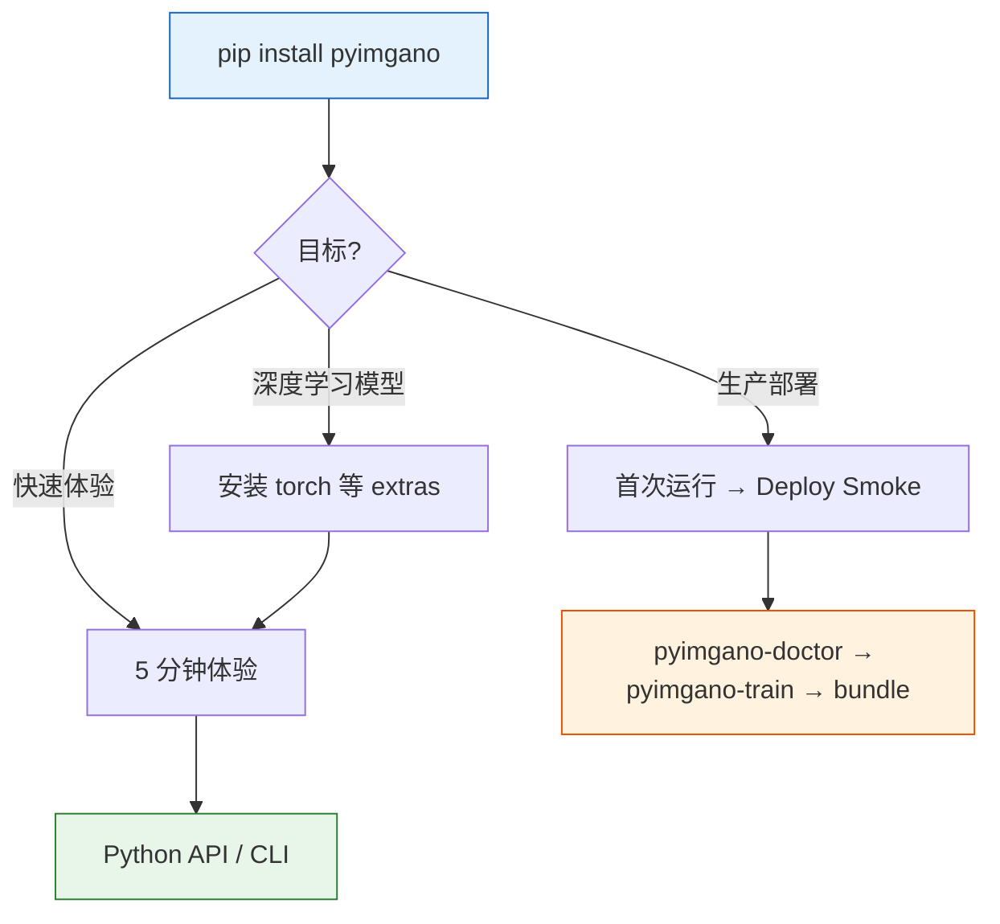

# 快速开始

=== "中文"

    从安装到首次异常检测，只需几分钟。选择下方路径开始。

=== "English"

    From installation to your first anomaly detection in minutes. Pick a path below.

---

### :material-download: 安装指南

安装 pyimgano 及可选依赖，配置 GPU 环境。

[:octicons-arrow-right-24: 安装](installation.md)

### :material-timer-sand: 5 分钟体验

Python API 与 CLI 两条路径，快速完成异常检测。

[:octicons-arrow-right-24: 快速开始](quickstart.md)

### :material-play-circle: 首次运行

部署冒烟测试、引导式工作流与 `pyimgano-doctor` 环境检查。

[:octicons-arrow-right-24: 首次运行](first-run.md)

---

## 推荐路径

