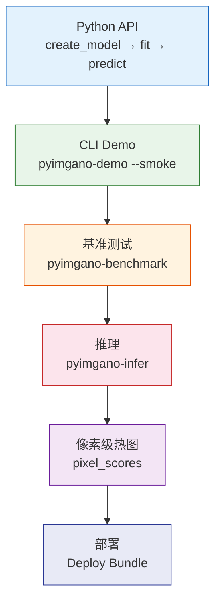

# 5 分钟体验

=== "中文"

    两条路径带你快速上手：**Python API** 适合集成开发，**CLI** 适合快速实验。

=== "English"

    Two paths to get started: **Python API** for integration, **CLI** for rapid experiments.

---

## 路径 1：Python API

### 最小示例

```python
from pyimgano import create_model

# 1. 创建模型
model = create_model("vision_iforest")

# 2. 训练 (仅需正常样本)
model.fit(X_train)

# 3. 异常分数
scores = model.decision_function(X_test)

# 4. 预测标签 (1=异常, 0=正常)
predictions = model.predict(X_test)
```

### 完整示例：图像异常检测

```python
import numpy as np
from pyimgano import create_model

# 准备数据: 正常图像 (N, H, W, C) uint8
X_train = np.random.randint(0, 255, (50, 64, 64, 3), dtype=np.uint8)
X_test = np.random.randint(0, 255, (10, 64, 64, 3), dtype=np.uint8)

# 创建并训练
model = create_model("vision_iforest")
model.fit(X_train)

# 推理
scores = model.decision_function(X_test)
predictions = model.predict(X_test)

print(f"异常分数: {scores}")
print(f"预测标签: {predictions}")
```

=== "中文"

    `create_model()` 支持 120+ 种注册模型。将 `"vision_iforest"` 替换为其他模型名即可切换算法。
    运行 `pyim --list models` 查看全部可用模型。

=== "English"

    `create_model()` supports 120+ registered models. Replace `"vision_iforest"` with any other
    model name to switch algorithms. Run `pyim --list models` to see all available models.

### 像素级异常热图

```python
from pyimgano import create_model

# 使用支持像素级输出的模型
model = create_model("patchcore")
model.fit(X_train)

# 获取像素级异常分数 (N, H, W)
pixel_scores = model.decision_function(X_test)
```

!!! note "像素级模型需要额外依赖"

    PatchCore 等深度模型需要 `pip install "pyimgano[torch]"`。

---

## 路径 2：CLI 快速实验

### 第一步：生成演示数据集

```bash
pyimgano-demo --smoke \
  --dataset-root ./_demo_custom_dataset \
  --output-dir ./_demo_suite_run \
  --summary-json /tmp/pyimgano_demo_summary.json \
  --emit-next-steps \
  --no-pretrained
```

=== "中文"

    `pyimgano-demo --smoke` 创建一个离线安全的小型数据集，并运行一组基线检测。适合在没有自定义数据时快速验证环境。

=== "English"

    `pyimgano-demo --smoke` creates a small offline-safe dataset and runs a baseline suite. Useful for quick environment validation without custom data.

### 第二步：运行基准测试

```bash
pyimgano-benchmark \
  --dataset custom \
  --root ./_demo_custom_dataset \
  --suite industrial-ci \
  --resize 32 32 \
  --limit-train 2 --limit-test 2 \
  --no-pretrained \
  --save-run \
  --output-dir ./_demo_benchmark_run \
  --suite-export csv
```

### 第三步：推理

```bash
pyimgano-infer \
  --model-preset industrial-template-ncc-map \
  --train-dir ./_demo_custom_dataset/train/normal \
  --input ./_demo_custom_dataset/test \
  --save-jsonl ./_demo_results.jsonl
```

### 第四步：查看结果

```bash
# 检查运行质量
pyimgano runs quality ./_demo_benchmark_run --json

# 查看 JSONL 推理结果
head -5 ./_demo_results.jsonl
```

---

## 渐进式工作流总结



=== "中文"

    | 阶段 | 方式 | 描述 |
    |------|------|------|
    | 快速验证 | Python API | 5 行代码完成异常检测 |
    | 快速实验 | CLI Demo | 离线数据集 + 基线套件 |
    | 系统评测 | CLI Benchmark | 多模型对比 + CSV 导出 |
    | 生产推理 | CLI Infer | JSONL 输出 + 像素级热图 |

=== "English"

    | Stage | Method | Description |
    |-------|--------|-------------|
    | Quick check | Python API | Anomaly detection in 5 lines |
    | Quick experiment | CLI Demo | Offline dataset + baseline suite |
    | Systematic eval | CLI Benchmark | Multi-model comparison + CSV export |
    | Production infer | CLI Infer | JSONL output + pixel-level maps |

---

## 下一步

- [首次运行](first-run.md) — 部署冒烟测试与引导式工作流
- [使用指南](../guide/index.md) — Python API 与 CLI 详细文档
- [模型库](../models/index.md) — 浏览 120+ 种检测模型
