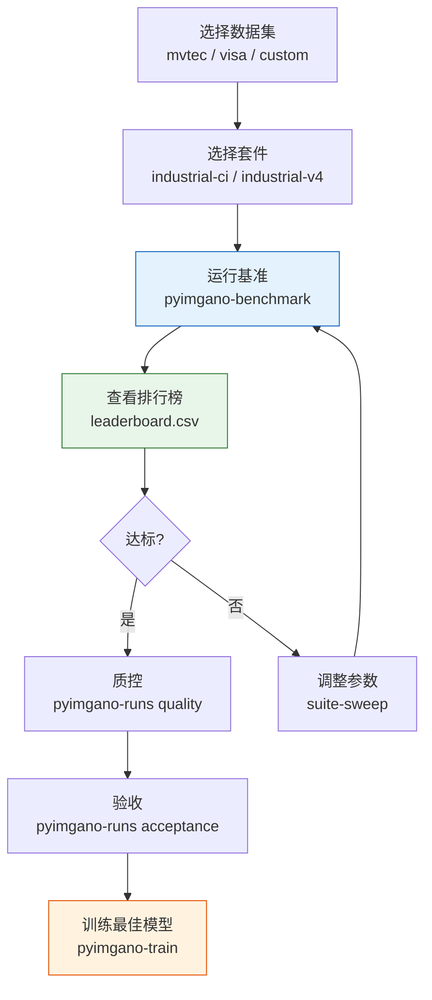

# 基准测试

=== "中文"

    `pyimgano-benchmark` 提供系统化的模型评测：套件管理、多数据集支持、指标计算和排行榜生成。

=== "English"

    `pyimgano-benchmark` provides systematic model evaluation: suite management, multi-dataset support, metric computation, and leaderboard generation.

---

## 基本用法

```bash
# 运行工业 CI 套件
pyimgano-benchmark \
  --dataset custom \
  --root ./my_dataset \
  --suite industrial-ci \
  --output-dir ./benchmark_run \
  --save-run

# 指定调整大小和样本限制 (快速验证)
pyimgano-benchmark \
  --dataset custom \
  --root ./my_dataset \
  --suite industrial-ci \
  --resize 64 64 \
  --limit-train 10 --limit-test 10 \
  --no-pretrained \
  --output-dir ./benchmark_quick
```

---

## 套件 (Suite)

=== "中文"

    套件定义了一组模型和配置的组合，用于标准化评测。

=== "English"

    Suites define a combination of models and configurations for standardized evaluation.

```bash
# 列出可用套件
pyimgano-benchmark --list-suites

# 工业 CI 套件 (快速，适合持续集成)
pyimgano-benchmark --suite industrial-ci ...

# 工业 v4 套件 (完整，适合系统评测)
pyimgano-benchmark --suite industrial-v4 ...
```

| 套件 | 描述 | 适用场景 |
|------|------|---------|
| `industrial-ci` | 轻量级，少量代表模型 | CI/CD 管道、冒烟测试 |
| `industrial-v4` | 全量模型对比 | 正式评测、模型选型 |

### Suite Sweep

```bash
# 参数扫描: 在多组配置上运行套件
pyimgano-benchmark \
  --suite industrial-ci \
  --suite-sweep \
  --dataset custom \
  --root ./my_dataset \
  --output-dir ./sweep_results
```

=== "中文"

    `--suite-sweep` 自动扫描套件中定义的参数组合（如不同特征提取器、不同超参数），一次运行生成完整对比。

=== "English"

    `--suite-sweep` automatically sweeps parameter combinations defined in the suite (e.g., different feature extractors, different hyperparameters), generating a complete comparison in one run.

---

## 数据集

```bash
# 公开数据集
pyimgano-benchmark --dataset mvtec --root ./MVTec_AD ...
pyimgano-benchmark --dataset visa --root ./VisA ...

# 自定义数据集
pyimgano-benchmark --dataset custom --root ./my_dataset ...
```

=== "中文"

    | 数据集 | 描述 |
    |--------|------|
    | `mvtec` | MVTec AD — 工业异常检测标准基准 |
    | `visa` | VisA — 视觉异常检测基准 |
    | `custom` | 自定义目录结构 |

=== "English"

    | Dataset | Description |
    |---------|-------------|
    | `mvtec` | MVTec AD — Standard industrial anomaly detection benchmark |
    | `visa` | VisA — Visual anomaly detection benchmark |
    | `custom` | Custom directory structure |

!!! note "自定义数据集目录结构"

    ```
    my_dataset/
    ├── train/
    │   └── normal/      # 正常训练样本
    └── test/
        ├── normal/      # 正常测试样本
        └── anomalous/   # 异常测试样本
    ```

---

## 指标

| 指标 | 级别 | 描述 |
|------|------|------|
| `auroc` | 图像 | Area Under ROC Curve |
| `ap` | 图像 | Average Precision |
| `f1` | 图像 | F1 Score (最优阈值) |
| `pixel_auroc` | 像素 | 像素级 AUROC |
| `pixel_ap` | 像素 | 像素级 Average Precision |
| `aupro` | 像素 | Area Under PRO Curve (Per-Region Overlap) |

=== "中文"

    - **图像级指标** 衡量整图异常检测性能
    - **像素级指标** 衡量缺陷定位精度
    - `aupro` 特别关注每个缺陷区域的检测质量，对小缺陷更公平

=== "English"

    - **Image-level metrics** measure whole-image anomaly detection performance
    - **Pixel-level metrics** measure defect localization accuracy
    - `aupro` specifically evaluates detection quality per defect region, fairer for small defects

---

## 运行产物

```bash
benchmark_run/
├── report.json          # 完整评测报告
├── leaderboard.csv      # 模型排行榜
├── per_model/
│   ├── vision_iforest/
│   │   └── metrics.json
│   └── vision_patchcore/
│       └── metrics.json
└── suite_export.csv     # 套件导出 (--suite-export csv)
```

=== "中文"

    | 产物 | 描述 |
    |------|------|
    | `report.json` | 包含所有模型的完整指标和配置 |
    | `leaderboard.csv` | 按指标排序的模型排行榜 |
    | `per_model/` | 每个模型的独立指标文件 |
    | `suite_export.csv` | 可导入电子表格的汇总表 |

=== "English"

    | Artifact | Description |
    |----------|-------------|
    | `report.json` | Full metrics and config for all models |
    | `leaderboard.csv` | Models ranked by metrics |
    | `per_model/` | Individual metrics per model |
    | `suite_export.csv` | Summary table for spreadsheet import |

---

## 运行管理

### 质量检查

```bash
# 检查运行质量
pyimgano-runs quality ./benchmark_run --json

# 验收测试
pyimgano-runs acceptance ./benchmark_run

# 发布就绪检查
pyimgano-runs publication ./benchmark_run
```

=== "中文"

    | 命令 | 描述 |
    |------|------|
    | `quality` | 基本质量门禁：指标是否合理、是否有失败模型 |
    | `acceptance` | 验收标准：指标是否达到目标阈值 |
    | `publication` | 发布检查：结果是否完整、可复现 |

=== "English"

    | Command | Description |
    |---------|-------------|
    | `quality` | Basic quality gate: are metrics reasonable, any failed models |
    | `acceptance` | Acceptance criteria: do metrics meet target thresholds |
    | `publication` | Publication check: are results complete and reproducible |

### 运行对比

```bash
# 对比两次运行
pyimgano-runs compare ./run_v1 ./run_v2 --json

# CSV 导出用于外部分析
pyimgano-benchmark \
  --suite industrial-ci \
  --dataset custom --root ./my_dataset \
  --suite-export csv \
  --output-dir ./benchmark_run
```

---

## 完整评测流程



---

## 下一步

- [训练](training.md) — 使用最佳模型配置进行正式训练
- [CLI 概览](cli-overview.md) — 完整命令行参考
- [合成异常](synthesis.md) — 生成合成数据扩展评测
