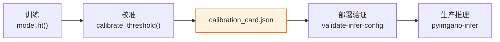

# 校准

=== "中文"

    校准将模型原始分数转换为可解释的阈值决策。包括阈值校准、分数标准化和部署验证。

=== "English"

    Calibration converts raw model scores into interpretable threshold decisions. This includes threshold calibration, score standardization, and deployment validation.

---

## 阈值校准

```python
from pyimgano.calibration import calibrate_threshold

# 使用验证集校准阈值
threshold = calibrate_threshold(
    scores=val_scores,       # 验证集异常分数
    labels=val_labels,       # 验证集标签 (0/1)
    method="f1",             # 优化目标
)
print(f"Optimal threshold: {threshold:.4f}")
```

=== "中文"

    `calibrate_threshold()` 在验证集上搜索最优阈值，支持多种优化目标：

    - `"f1"` — 最大化 F1 分数（默认）
    - `"precision"` — 目标精确率下的阈值
    - `"recall"` — 目标召回率下的阈值

=== "English"

    `calibrate_threshold()` searches for the optimal threshold on a validation set, supporting multiple optimization targets:

    - `"f1"` — Maximize F1 score (default)
    - `"precision"` — Threshold at target precision
    - `"recall"` — Threshold at target recall

---

## 分数标准化

=== "中文"

    不同模型输出的分数范围差异很大。标准化将分数映射到可比较的尺度。

=== "English"

    Different models output scores in vastly different ranges. Standardization maps scores to a comparable scale.

```python
from pyimgano.calibration import standardize_scores

# rank: 基于排序的百分位标准化 (推荐)
normed = standardize_scores(scores, method="rank")

# zscore: z 分数标准化
normed = standardize_scores(scores, method="zscore")

# robust: 基于中位数和 MAD 的鲁棒标准化
normed = standardize_scores(scores, method="robust")

# minmax: 最小-最大缩放
normed = standardize_scores(scores, method="minmax")
```

| 方法 | 描述 | 适用场景 |
|------|------|---------|
| `rank` | 百分位排序，输出 [0, 1] | 通用推荐 |
| `zscore` | 均值/标准差标准化 | 正态分布分数 |
| `robust` | 中位数/MAD 标准化 | 含离群值 |
| `minmax` | 线性缩放到 [0, 1] | 已知分数范围 |

!!! tip "推荐使用 rank"

    `rank` 方法对分数分布不做假设，在大多数场景下表现稳定。

---

## 像素级阈值校准

```python
from pyimgano.calibration import calibrate_threshold

# 像素级校准: 使用像素级分数和掩码标签
pixel_threshold = calibrate_threshold(
    scores=pixel_scores.flatten(),     # (N*H*W,)
    labels=pixel_labels.flatten(),     # (N*H*W,)
    method="f1",
)
```

=== "中文"

    像素级校准与图像级校准使用相同的 API，只需将分数和标签展平为一维数组。

=== "English"

    Pixel-level calibration uses the same API as image-level calibration — simply flatten scores and labels to 1D arrays.

---

## calibration_card.json

```json
{
  "version": "1.0",
  "model": "vision_patchcore",
  "threshold": 0.7523,
  "method": "f1",
  "standardization": "rank",
  "metrics": {
    "f1": 0.92,
    "precision": 0.89,
    "recall": 0.95
  },
  "provenance": {
    "dataset": "factory_line_A",
    "n_samples": 500,
    "calibrated_at": "2026-03-15T10:30:00Z",
    "pyimgano_version": "0.8.0"
  }
}
```

=== "中文"

    `calibration_card.json` 记录校准的完整上下文：

    | 字段 | 描述 |
    |------|------|
    | `threshold` | 校准后的决策阈值 |
    | `method` | 优化目标 |
    | `standardization` | 分数标准化方法 |
    | `metrics` | 校准时的评估指标 |
    | `provenance` | 溯源信息：数据集、样本数、时间、版本 |

=== "English"

    `calibration_card.json` records the full calibration context:

    | Field | Description |
    |-------|-------------|
    | `threshold` | Calibrated decision threshold |
    | `method` | Optimization target |
    | `standardization` | Score standardization method |
    | `metrics` | Evaluation metrics at calibration time |
    | `provenance` | Provenance: dataset, sample count, timestamp, version |

---

## 阈值溯源

=== "中文"

    溯源跟踪确保每个阈值决策都能追溯到其校准条件。这在生产环境中至关重要——当检测结果发生变化时，可以快速定位是数据漂移还是校准问题。

=== "English"

    Provenance tracking ensures every threshold decision can be traced back to its calibration conditions. This is critical in production — when detection results change, you can quickly identify whether it's data drift or a calibration issue.



---

## 部署验证

```bash
# 验证推理配置和校准卡完整性
pyimgano-validate-infer-config \
  --infer-config ./training_output/infer_config.json \
  --calibration-card ./calibration_card.json
```

=== "中文"

    `pyimgano-validate-infer-config` 在部署前验证：

    - 推理配置与模型兼容性
    - 校准卡字段完整性
    - 阈值与标准化方法一致性
    - 版本兼容性

=== "English"

    `pyimgano-validate-infer-config` validates before deployment:

    - Inference config and model compatibility
    - Calibration card field completeness
    - Threshold and standardization method consistency
    - Version compatibility

---

## 下一步

- [缺陷检测](defects.md) — 基于校准阈值的缺陷检测管线
- [推理](inference.md) — 生产推理集成
- [训练](training.md) — 训练产物管理
