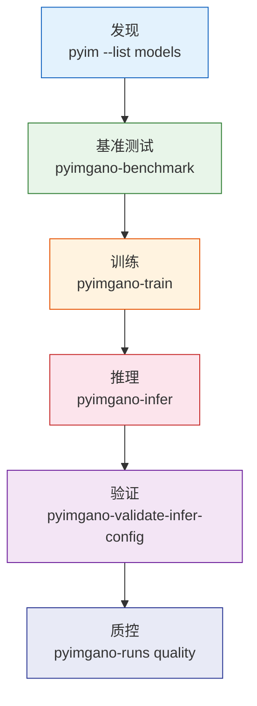

# CLI 概览

=== "中文"

    pyimgano 提供 20+ 个命令行工具，覆盖从模型发现到生产部署的完整工作流。所有命令支持 `--help` 查看详细用法。

=== "English"

    pyimgano provides 20+ CLI tools covering the full workflow from model discovery to production deployment. All commands support `--help` for detailed usage.

---

## 入口

```bash
# 查看所有可用命令
pyimgano --help

# 快捷发现命令
pyim --list models        # 列出全部模型
pyim --list recipes       # 列出训练 recipe
pyim --list presets       # 列出推理预设
```

!!! tip "pyim 快捷方式"

    `pyim` 是 `pyimgano` 的轻量快捷入口，专用于发现与查询操作。

---

## 命令速查表

| 命令 | 描述 |
|------|------|
| **训练与建模** | |
| `pyimgano-train` | 使用配置文件训练模型 |
| `pyimgano-benchmark` | 多模型/多数据集系统评测 |
| `pyimgano-runs` | 管理和查询训练运行记录 |
| **推理与部署** | |
| `pyimgano-infer` | 批量图像推理 |
| `pyimgano-validate-infer-config` | 验证推理配置和 deploy bundle |
| `pyimgano-export-bundle` | 导出部署包 |
| **缺陷分析** | |
| `pyimgano-defects` | 独立缺陷检测管线 |
| `pyimgano-synthesize` | 合成异常样本生成 |
| **评估与质控** | |
| `pyimgano-runs quality` | 运行质量检查 |
| `pyimgano-runs acceptance` | 验收测试 |
| `pyimgano-runs publication` | 发布就绪检查 |
| **辅助工具** | |
| `pyimgano-demo` | 演示数据集与冒烟测试 |
| `pyimgano-doctor` | 环境诊断 |
| `pyim` | 快捷发现工具 |

---

## 引导式工作流



=== "中文"

    **推荐工作流程：**

    1. **发现** — `pyim --list models` 浏览可用模型和预设
    2. **基准测试** — `pyimgano-benchmark` 在目标数据上对比候选模型
    3. **训练** — `pyimgano-train --config` 用最佳模型配置进行正式训练
    4. **推理** — `pyimgano-infer` 在测试数据上批量推理
    5. **验证** — `pyimgano-validate-infer-config` 验证推理配置完整性
    6. **质控** — `pyimgano-runs quality` 检查运行质量是否达标

=== "English"

    **Recommended workflow:**

    1. **Discover** — `pyim --list models` to browse available models and presets
    2. **Benchmark** — `pyimgano-benchmark` to compare candidate models on target data
    3. **Train** — `pyimgano-train --config` for formal training with the best model config
    4. **Infer** — `pyimgano-infer` for batch inference on test data
    5. **Validate** — `pyimgano-validate-infer-config` to verify inference config integrity
    6. **Gate** — `pyimgano-runs quality` to check run quality meets requirements

---

## 通用标志

```bash
# JSON 结构化输出 (适合管道和自动化)
pyimgano-benchmark --suite industrial-ci --json

# 禁用预训练权重下载 (离线/CI 环境)
pyimgano-benchmark --no-pretrained

# 指定计算设备
pyimgano-train --config train.json --device cuda:0
pyimgano-train --config train.json --device cpu
```

=== "中文"

    | 标志 | 适用命令 | 描述 |
    |------|---------|------|
    | `--json` | 多数命令 | JSON 格式输出，方便脚本解析 |
    | `--no-pretrained` | 训练/推理/基准 | 不下载预训练权重 |
    | `--device` | 训练/推理 | 指定 `cpu`、`cuda`、`cuda:N` |
    | `--help` | 所有命令 | 显示详细帮助信息 |

=== "English"

    | Flag | Commands | Description |
    |------|----------|-------------|
    | `--json` | Most commands | JSON-formatted output for scripting |
    | `--no-pretrained` | Train/infer/benchmark | Skip pretrained weight download |
    | `--device` | Train/infer | Specify `cpu`, `cuda`, `cuda:N` |
    | `--help` | All commands | Show detailed help |

---

## 下一步

- [训练](training.md) — `pyimgano-train` 详细用法
- [推理](inference.md) — `pyimgano-infer` 详细用法
- [基准测试](benchmarking.md) — `pyimgano-benchmark` 详细用法
