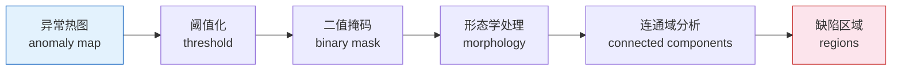
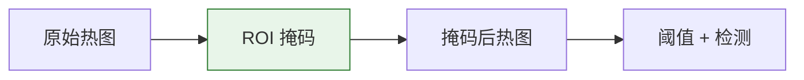

# 缺陷检测

=== "中文"

    缺陷检测管线将像素级异常热图转换为结构化的缺陷区域，支持 ROI 约束、形态学处理和可视化叠加。

=== "English"

    The defect detection pipeline converts pixel-level anomaly heatmaps into structured defect regions, with ROI constraints, morphological processing, and visualization overlays.

---

## 管线流程



=== "中文"

    1. **异常热图** — 模型输出的像素级异常分数
    2. **阈值化** — 将分数转为二值掩码（使用校准阈值）
    3. **形态学处理** — 开/闭运算去除噪点、填补空洞
    4. **连通域分析** — 识别独立的缺陷区域
    5. **区域输出** — 每个区域的 bbox、面积、质心等属性

=== "English"

    1. **Anomaly map** — Pixel-level anomaly scores from the model
    2. **Thresholding** — Convert scores to binary mask (using calibrated threshold)
    3. **Morphological processing** — Opening/closing to remove noise, fill holes
    4. **Connected component analysis** — Identify independent defect regions
    5. **Region output** — Bbox, area, centroid, and other attributes per region

---

## CLI 用法

### 独立缺陷检测

```bash
# 从异常热图运行缺陷检测
pyimgano-defects \
  --input ./anomaly_maps/ \
  --threshold 0.75 \
  --save-masks ./output/masks \
  --save-overlays ./output/overlays \
  --save-jsonl ./defects.jsonl
```

### 集成到推理管线

```bash
# 推理 + 缺陷检测一体化
pyimgano-infer \
  --model vision_patchcore \
  --train-dir ./data/train/normal \
  --input ./data/test \
  --defects \
  --defects-preset industrial-default \
  --save-masks ./output/masks \
  --save-overlays ./output/overlays \
  --save-jsonl ./results.jsonl
```

=== "中文"

    `--defects` 标志在 `pyimgano-infer` 中启用缺陷检测后处理，无需单独运行 `pyimgano-defects`。

=== "English"

    The `--defects` flag enables defect detection post-processing within `pyimgano-infer`, eliminating the need to run `pyimgano-defects` separately.

---

## ROI 区域约束

=== "中文"

    ROI（感兴趣区域）掩码用于排除背景区域，仅在指定区域内检测缺陷。典型场景：排除传送带背景、仅检测产品表面。

=== "English"

    ROI (Region of Interest) masks exclude background areas, detecting defects only within the specified region. Typical use case: excluding conveyor belt background, inspecting product surface only.

```bash
# 使用 ROI 掩码
pyimgano-defects \
  --input ./anomaly_maps/ \
  --roi-mask ./roi/product_mask.png \
  --threshold 0.75 \
  --save-jsonl ./defects.jsonl
```



!!! tip "ROI 掩码格式"

    ROI 掩码为单通道图像，与输入图像同尺寸。白色 (255) 表示检测区域，黑色 (0) 表示排除区域。

---

## 叠加可视化

```bash
# 生成调试用叠加图
pyimgano-defects \
  --input ./anomaly_maps/ \
  --original-images ./data/test \
  --threshold 0.75 \
  --save-overlays ./output/overlays
```

=== "中文"

    叠加图将缺陷区域的边界框和掩码标注在原始图像上，便于人工复查和调试。每个缺陷区域用不同颜色标注。

=== "English"

    Overlay images annotate defect region bounding boxes and masks on the original image for manual review and debugging. Each defect region is marked with a distinct color.

---

## 区域输出格式

```json
{
  "path": "test/img_001.png",
  "num_defects": 2,
  "regions": [
    {
      "id": 0,
      "bbox": [120, 80, 180, 150],
      "area": 2340,
      "centroid": [150.5, 115.2]
    },
    {
      "id": 1,
      "bbox": [300, 200, 340, 260],
      "area": 1580,
      "centroid": [320.1, 230.8]
    }
  ]
}
```

=== "中文"

    | 字段 | 描述 |
    |------|------|
    | `bbox` | 边界框 `[x_min, y_min, x_max, y_max]` |
    | `area` | 缺陷区域面积（像素数） |
    | `centroid` | 质心坐标 `[x, y]` |
    | `num_defects` | 检测到的缺陷数量 |

=== "English"

    | Field | Description |
    |-------|-------------|
    | `bbox` | Bounding box `[x_min, y_min, x_max, y_max]` |
    | `area` | Defect region area (pixel count) |
    | `centroid` | Centroid coordinates `[x, y]` |
    | `num_defects` | Number of detected defects |

---

## 下一步

- [校准](calibration.md) — 阈值校准方法
- [推理](inference.md) — 推理管线中的缺陷检测集成
- [合成异常](synthesis.md) — 生成训练用合成缺陷
