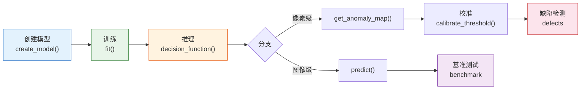

# 使用指南

=== "中文"

    本指南涵盖 pyimgano 的核心工作流：从 Python API 到 CLI 工具链，从训练到部署的完整路径。

=== "English"

    This guide covers pyimgano's core workflows: from Python API to CLI toolchain, from training to deployment.

---

### :material-language-python: Python API

核心四步法：`create_model()` → `fit()` → `decision_function()` → `predict()`，支持图像级与像素级异常检测。

[:octicons-arrow-right-24: Python API](python-api.md)

### :material-console: CLI 概览

20+ 命令速查，从 `pyimgano-train` 到 `pyimgano-infer` 的完整工具链一览。

[:octicons-arrow-right-24: CLI 概览](cli-overview.md)

### :material-school: 训练

使用 `pyimgano-train` 和配置文件训练模型，管理 recipe、checkpoint 和报告产物。

[:octicons-arrow-right-24: 训练](training.md)

### :material-magnify-scan: 推理

`pyimgano-infer` 进行批量推理，支持分块、缺陷检测集成和多种输出格式。

[:octicons-arrow-right-24: 推理](inference.md)

### :material-tune-vertical: 校准

阈值校准、分数标准化与 `calibration_card.json` 产物管理。

[:octicons-arrow-right-24: 校准](calibration.md)

### :material-target: 缺陷检测

从异常热图到结构化缺陷区域：阈值 → 形态学 → 连通域 → 区域输出。

[:octicons-arrow-right-24: 缺陷检测](defects.md)

### :material-creation: 合成异常

17+ 内置预设（划痕、污渍、锈蚀……），DefectBank 与工业相机伪影模拟。

[:octicons-arrow-right-24: 合成异常](synthesis.md)

### :material-chart-bar: 基准测试

`pyimgano-benchmark` 系统评测：套件、sweep、多数据集与排行榜。

[:octicons-arrow-right-24: 基准测试](benchmarking.md)

---

## 工作流总览

=== "中文"

    | 阶段 | Python API | CLI |
    |------|-----------|-----|
    | 模型创建 | `create_model("model_name")` | `pyimgano-train --config` |
    | 训练 | `model.fit(X_train)` | `pyimgano-train` |
    | 推理 | `model.decision_function(X)` | `pyimgano-infer` |
    | 校准 | `calibrate_threshold()` | `pyimgano-validate-infer-config` |
    | 缺陷检测 | `defects` 模块 | `pyimgano-defects` |
    | 合成异常 | `AnomalySynthesizer` | `pyimgano-synthesize` |
    | 基准测试 | — | `pyimgano-benchmark` |

=== "English"

    | Stage | Python API | CLI |
    |-------|-----------|-----|
    | Model creation | `create_model("model_name")` | `pyimgano-train --config` |
    | Training | `model.fit(X_train)` | `pyimgano-train` |
    | Inference | `model.decision_function(X)` | `pyimgano-infer` |
    | Calibration | `calibrate_threshold()` | `pyimgano-validate-infer-config` |
    | Defect detection | `defects` module | `pyimgano-defects` |
    | Synthesis | `AnomalySynthesizer` | `pyimgano-synthesize` |
    | Benchmarking | — | `pyimgano-benchmark` |
