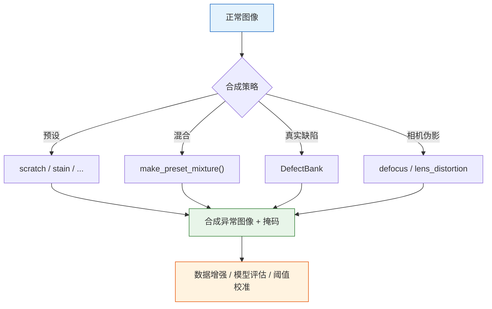

# 合成异常

=== "中文"

    pyimgano 提供 17+ 种合成异常预设，支持自定义混合、多缺陷叠加和工业相机伪影模拟。合成数据可用于数据增强、模型评估和阈值校准。

=== "English"

    pyimgano provides 17+ synthetic anomaly presets with custom mixing, multi-defect overlay, and industrial camera artifact simulation. Synthetic data can be used for data augmentation, model evaluation, and threshold calibration.

---

## Python API

### 基本用法

```python
from pyimgano.synthesis import AnomalySynthesizer, SynthSpec

# 创建合成器
synth = AnomalySynthesizer()

# 定义合成规格
spec = SynthSpec(
    preset="scratch",     # 预设类型
    severity=0.7,         # 严重程度 [0, 1]
    num_defects=3,        # 缺陷数量
)

# 在正常图像上合成异常
anomalous_image, defect_mask = synth.synthesize(normal_image, spec)
```

### 预设混合

```python
from pyimgano.synthesis import make_preset_mixture

# 创建多预设混合
mixture = make_preset_mixture(
    presets=["scratch", "stain", "pit"],
    weights=[0.5, 0.3, 0.2],
)

spec = SynthSpec(preset=mixture, severity=0.6)
anomalous_image, defect_mask = synth.synthesize(normal_image, spec)
```

---

## 内置预设

| 预设 | 描述 |
|------|------|
| `scratch` | 线性划痕 |
| `stain` | 不规则污渍 |
| `pit` | 点状凹坑 |
| `glare` | 光斑/反光 |
| `rust` | 锈蚀纹理 |
| `oil` | 油渍 |
| `crack` | 裂纹 |
| `brush` | 刷痕 |
| `spatter` | 飞溅痕迹 |
| `tape` | 胶带残留 |
| `marker` | 标记痕迹 |
| `burn` | 烧灼痕迹 |
| `bubble` | 气泡/鼓包 |
| `fiber` | 纤维/毛发 |
| `wrinkle` | 褶皱 |
| `texture` | 纹理异常 |
| `edge_wear` | 边缘磨损 |

=== "中文"

    每种预设模拟特定的工业缺陷类型，`severity` 参数控制缺陷的显著程度。

=== "English"

    Each preset simulates a specific industrial defect type. The `severity` parameter controls the defect's prominence.

---

## CLI 用法

```bash
# 基本合成
pyimgano-synthesize \
  --input ./data/train/normal \
  --output ./data/synthetic \
  --preset scratch \
  --severity 0.7 \
  --num-defects 2 \
  --count 100

# 多预设混合
pyimgano-synthesize \
  --input ./data/train/normal \
  --output ./data/synthetic \
  --preset scratch stain pit \
  --severity 0.5 \
  --count 200

# 带 ROI 约束
pyimgano-synthesize \
  --input ./data/train/normal \
  --output ./data/synthetic \
  --preset rust \
  --roi-mask ./roi/product_surface.png \
  --count 50
```

=== "中文"

    | 参数 | 描述 |
    |------|------|
    | `--input` | 正常图像目录 |
    | `--output` | 合成图像输出目录 |
    | `--preset` | 预设名称（可多选） |
    | `--severity` | 缺陷严重程度 [0, 1] |
    | `--num-defects` | 每张图像的缺陷数量 |
    | `--count` | 生成图像总数 |
    | `--roi-mask` | ROI 掩码，限制缺陷生成区域 |

=== "English"

    | Flag | Description |
    |------|-------------|
    | `--input` | Normal image directory |
    | `--output` | Synthetic image output directory |
    | `--preset` | Preset name(s) (multi-select) |
    | `--severity` | Defect severity [0, 1] |
    | `--num-defects` | Number of defects per image |
    | `--count` | Total images to generate |
    | `--roi-mask` | ROI mask to constrain defect placement |

---

## DefectBank

=== "中文"

    DefectBank 从真实缺陷图像中提取缺陷模板，通过复制粘贴方式在新图像上生成逼真异常。比纯合成预设更贴近实际缺陷外观。

=== "English"

    DefectBank extracts defect templates from real defect images and generates realistic anomalies via copy-paste onto new images. More realistic than pure synthetic presets.

```python
from pyimgano.synthesis import DefectBank

# 从真实缺陷构建 DefectBank
bank = DefectBank.from_directory(
    defect_dir="./data/real_defects",
    mask_dir="./data/real_defect_masks",
)

# 使用 DefectBank 生成合成异常
anomalous_image, defect_mask = bank.apply(normal_image, num_defects=2)
```

```bash
# CLI: 使用 DefectBank
pyimgano-synthesize \
  --input ./data/train/normal \
  --output ./data/synthetic \
  --defect-bank ./data/real_defects \
  --defect-bank-masks ./data/real_defect_masks \
  --count 100
```

---

## 工业相机伪影

=== "中文"

    模拟真实工业相机可能产生的光学伪影，增强模型对相机条件变化的鲁棒性。

=== "English"

    Simulate optical artifacts from real industrial cameras to improve model robustness against changing camera conditions.

```python
from pyimgano.synthesis import AnomalySynthesizer, SynthSpec

synth = AnomalySynthesizer()

# 散焦模糊
spec = SynthSpec(preset="defocus", severity=0.4)
blurred, _ = synth.synthesize(normal_image, spec)

# 镜头畸变
spec = SynthSpec(preset="lens_distortion", severity=0.3)
distorted, _ = synth.synthesize(normal_image, spec)
```

| 伪影 | 描述 |
|------|------|
| `defocus` | 散焦模糊（模拟对焦不良） |
| `lens_distortion` | 镜头畸变（桶形/枕形失真） |

---

## 合成工作流



---

## 下一步

- [缺陷检测](defects.md) — 对合成数据运行缺陷检测管线
- [基准测试](benchmarking.md) — 使用合成数据评估模型
- [训练](training.md) — 将合成数据纳入训练流程
