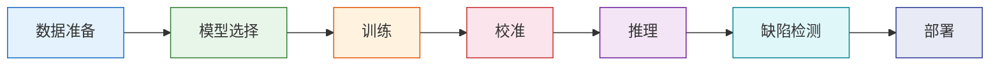

<div class="pyimgano-hero" markdown>

# pyimgano

<p class="hero-subtitle">企业级视觉异常检测工具包 | Enterprise-Grade Visual Anomaly Detection Toolkit</p>

<div class="hero-badges">
  <a href="https://pypi.org/project/pyimgano/"></a>
  <a href="https://pypi.org/project/pyimgano/"></a>
  <a href="https://github.com/skygazer42/pyimgano/actions"></a>
  <a href="https://github.com/skygazer42/pyimgano/blob/main/LICENSE"></a>
</div>

<span class="version-badge">v0.9.0</span>

</div>

---

=== "中文"

    **pyimgano** 是一个面向工业视觉质检场景的异常检测工具包。它将 120+ 种检测模型、
    20+ 条 CLI 命令和 80+ 个预处理算子整合到统一的 API 中，覆盖从快速原型到生产部署的完整流程。

=== "English"

    **pyimgano** is an anomaly detection toolkit built for industrial visual inspection.
    It unifies 120+ detection models, 20+ CLI commands, and 80+ preprocessing operators
    under a consistent API — from rapid prototyping to production deployment.

---

## 功能导航

<div class="grid" markdown>

<div class="card" markdown>

### :material-rocket-launch: 快速开始

安装、5 分钟体验与首次运行指南。

[:octicons-arrow-right-24: 开始使用](getting-started/index.md)

</div>

<div class="card" markdown>

### :material-database-search: 模型库

120+ 模型注册表：经典、深度学习、视觉语言模型。

[:octicons-arrow-right-24: 浏览模型](models/index.md)

</div>

<div class="card" markdown>

### :material-book-open-variant: 使用指南

Python API、CLI 工作流、训练、推理、校准与缺陷检测。

[:octicons-arrow-right-24: 查看指南](guide/index.md)

</div>

<div class="card" markdown>

### :material-truck-delivery: 部署

ONNX / OpenVINO 导出、Deploy Bundle、工业生产部署。

[:octicons-arrow-right-24: 部署方案](deployment/index.md)

</div>

<div class="card" markdown>

### :material-console: CLI 参考

`pyimgano`、`pyim`、`pyimgano-train`、`pyimgano-infer` 等 20+ 命令。

[:octicons-arrow-right-24: CLI 文档](reference/cli.md)

</div>

<div class="card" markdown>

### :material-flask: 实战配方

工业检测、Embedding + Core、像素级基线等场景方案。

[:octicons-arrow-right-24: 查看配方](recipes/index.md)

</div>

</div>

---

## 能力对比

=== "中文"

    与研究型异常检测库和通用表格 AD 工具相比，pyimgano 聚焦于**工业视觉检测**的完整生命周期。

=== "English"

    Compared with research-focused AD libraries and tabular AD toolkits, pyimgano focuses
    on the **full lifecycle of industrial visual inspection**.

<table class="capability-matrix">
<thead>
<tr>
<th>能力</th>
<th>研究型视觉 AD 库</th>
<th>表格 AD 工具</th>
<th>pyimgano</th>
</tr>
</thead>
<tbody>
<tr><td>图像级异常检测</td><td>:material-check:</td><td>:material-close:</td><td>:material-check:</td></tr>
<tr><td>像素级异常分割</td><td>:material-check:</td><td>:material-close:</td><td>:material-check:</td></tr>
<tr><td>经典 + 深度 + VLM 模型</td><td>部分</td><td>:material-close:</td><td>:material-check:</td></tr>
<tr><td>统一 CLI 工作流</td><td>:material-close:</td><td>:material-close:</td><td>:material-check:</td></tr>
<tr><td>Deploy Bundle 导出</td><td>:material-close:</td><td>:material-close:</td><td>:material-check:</td></tr>
<tr><td>工业基准套件</td><td>部分</td><td>:material-close:</td><td>:material-check:</td></tr>
<tr><td>合成异常生成</td><td>:material-close:</td><td>:material-close:</td><td>:material-check:</td></tr>
<tr><td>离线安全 (无隐式下载)</td><td>:material-close:</td><td>:material-check:</td><td>:material-check:</td></tr>
</tbody>
</table>

---

## 典型工作流



---

## 最小示例

```python
from pyimgano import create_model

model = create_model("vision_iforest")
model.fit(X_train)
scores = model.decision_function(X_test)
predictions = model.predict(X_test)
```

=== "中文"

    5 行代码即可完成异常检测。通过 `create_model()` 选择 120+ 种注册模型中的任意一种，
    调用 `fit()` → `decision_function()` → `predict()` 完成训练与推理。

=== "English"

    Anomaly detection in 5 lines of code. Pick any of the 120+ registered models via
    `create_model()`, then call `fit()` → `decision_function()` → `predict()`.

---

## 下一步

<div class="grid" markdown>

<div class="card" markdown>

**安装 pyimgano**

```bash
pip install pyimgano
```

[:octicons-arrow-right-24: 安装指南](getting-started/installation.md)

</div>

<div class="card" markdown>

**5 分钟体验**

从零开始完成一次异常检测。

[:octicons-arrow-right-24: 快速开始](getting-started/quickstart.md)

</div>

</div>
