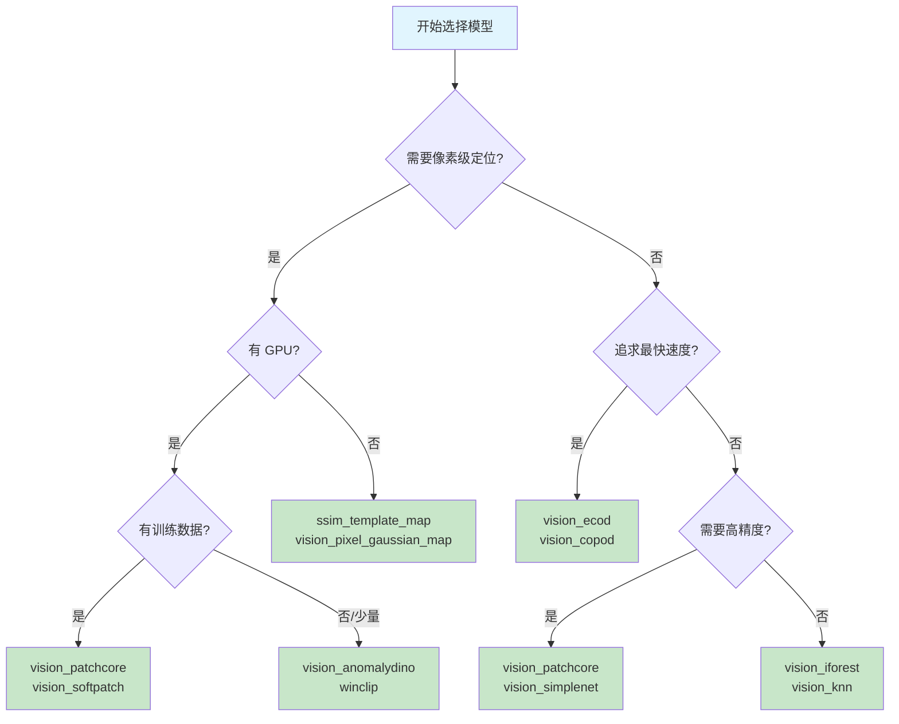

# 模型总览

=== "中文"

    pyimgano v0.8.0 提供 **120+ 注册模型**（含别名共 278 个名称），覆盖经典统计、深度学习和视觉-语言三大类别。
    本页帮助你快速选择最适合场景的算法。

=== "English"

    pyimgano v0.8.0 ships **120+ registered models** (278 total names including aliases), spanning classical statistics, deep learning, and vision-language categories.
    This page helps you pick the right algorithm for your use case.

---

## 算法能力矩阵

| 维度 / Dimension | Classical | Deep | VLM |
|:---|:---:|:---:|:---:|
| 推理速度 / Speed | :material-lightning-bolt: 极快 | :material-speedometer-medium: 中等 | :material-speedometer-slow: 较慢 |
| 检测精度 / Accuracy | :material-star-half-full: 中等 | :material-star: 高 | :material-star: 高 |
| 像素定位 / Pixel Maps | 部分支持 (template) | 大多支持 | 大多支持 |
| 需要训练 / Training Required | 是 (通常 < 1s) | 是 (分钟级) | 零样本 / 少样本 |
| 需要 GPU / GPU Required | 否 | 推荐 | 推荐 |
| 典型依赖 / Dependencies | numpy, scipy | torch | torch, open_clip |

---

## 推荐基线

=== "中文"

    根据典型工业场景，以下是推荐的起步模型。

=== "English"

    Recommended starting models for typical industrial scenarios.

| 场景 / Use Case | 推荐模型 / Recommended Models | 说明 / Notes |
|:---|:---|:---|
| 最佳综合 / Best overall | `vision_ecod`, `vision_copod`, `vision_iforest` | 无参数 / 快速 / 稳定 |
| 像素定位 / Pixel localization | `vision_patchcore`, `vision_softpatch`, `vision_anomalydino` | 需要 GPU，输出异常热力图 |
| CPU 快速筛查 / CPU screening | `vision_ecod`, `ssim_template_map` | 毫秒级推理，无 GPU 依赖 |
| 部署就绪 / Deploy-ready | `vision_ecod`, `vision_onnx_ecod` | 支持 ONNX 导出 |
| 零参数调优 / No parameter tuning | `vision_ecod`, `vision_copod` | parameter-free 标签 |
| 零样本 / Zero-shot | `winclip`, `vision_anomalydino` | 无需训练数据 (VLM) |

---

## 决策流程图



---

## CLI 快速发现

=== "中文"

    通过命令行快速发现和筛选可用模型。

=== "English"

    Discover and filter available models from the command line.

```bash
# 引导式首次运行
pyim --goal first-run

# 列出所有模型
pyim --list models

# 按目标筛选（低延迟优先）
pyim --list models --objective latency

# 按标签筛选
pyimgano-benchmark --list-models --tags classical
pyimgano-benchmark --list-models --tags deep,pixel_map
```

### Python 发现

```python
from pyimgano.models.registry import list_models

# 所有模型
all_models = list_models()
print(f"共 {len(all_models)} 个模型")

# 按标签筛选
classical = list_models(tags=["classical"])
deep_pixel = list_models(tags=["deep", "pixel_map"])
```

---

## 起步配置

=== "中文"

    最小可运行示例 -- 三行代码完成训练与推理。

=== "English"

    Minimal runnable example -- three lines of code for training and inference.

```python
from pyimgano import create_model

model = create_model("vision_ecod")    # 经典 / Classical
model.fit(train_images)
scores = model.decision_function(test_images)
```

```python
from pyimgano import create_model

model = create_model("vision_patchcore",  # 深度 / Deep
                     coreset_sampling_ratio=0.1,
                     device="cuda")
model.fit(train_images)
scores = model.decision_function(test_images)
anomaly_map = model.get_anomaly_map(test_images[0])
```

---

## 下一步

=== "中文"

    - [经典模型详解](classical.md) -- 统计 / 近邻 / 树 / 集成 / 模板基线
    - [深度学习模型](deep.md) -- PatchCore / STFPM / FastFlow / DRAEM 等
    - [视觉-语言模型](vlm.md) -- WinCLIP / AnomalyDINO / PromptAD
    - [模型注册表](registry.md) -- 完整名称列表 / 标签系统 / 自定义注册

=== "English"

    - [Classical Models](classical.md) -- Statistical / Neighbor / Tree / Ensemble / Template baselines
    - [Deep Learning Models](deep.md) -- PatchCore / STFPM / FastFlow / DRAEM etc.
    - [Vision-Language Models](vlm.md) -- WinCLIP / AnomalyDINO / PromptAD
    - [Model Registry](registry.md) -- Full name list / Tag system / Custom registration
