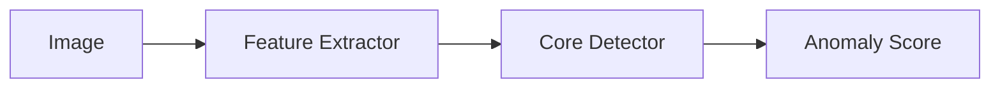

# Embedding + Core 配方

=== "中文"

    Embedding + Core 路线将深度学习特征提取器与经典异常检测器组合使用。
    这种方法兼具深度特征的表达力和经典方法的可解释性与低资源需求。

=== "English"

    The Embedding + Core route combines deep feature extractors with classical anomaly
    detectors. This approach offers the expressiveness of deep features alongside the
    interpretability and low resource requirements of classical methods.



---

## 配方 1: Torchvision Embeddings + ECOD

=== "中文"

    最常用的组合：使用 `torchvision_backbone` 提取 ResNet/EfficientNet 嵌入特征，
    再用 `core_ecod` 检测异常。

=== "English"

    The most common combination: use `torchvision_backbone` to extract ResNet/EfficientNet
    embeddings, then apply `core_ecod` for anomaly detection.

```json title="config_embedding_ecod.json"
{
  "model": "vision_embedding_core",
  "model_kwargs": {
    "embedder_spec": {
      "name": "torchvision_backbone",
      "kwargs": {
        "model_name": "resnet18",
        "pretrained": false
      }
    },
    "core_spec": {
      "name": "core_ecod"
    }
  },
  "dataset": {
    "root": "./data/my_product",
    "manifest": "manifest.jsonl",
    "image_size": [224, 224]
  }
}
```

```bash
# 训练
pyimgano-train fit --config config_embedding_ecod.json

# 推理
pyimgano-infer \
  --model vision_embedding_core \
  --model-kwargs '{"embedder_spec":{"name":"torchvision_backbone","kwargs":{"model_name":"resnet18","pretrained":false}},"core_spec":{"name":"core_ecod"}}' \
  --data ./data/my_product/test/ \
  --output-dir ./results/
```

=== "中文"

    也可以直接使用预配置的快捷模型名称：

=== "English"

    You can also use a preconfigured shortcut model name:

```bash
pyimgano-infer \
  --model vision_resnet18_ecod \
  --data ./data/my_product/test/
```

---

## 配方 2: TorchScript Embeddings + ECOD（自带检查点）

=== "中文"

    当你有自己的特征提取模型时，使用 `torchscript_embed` 加载 TorchScript 检查点，
    完全离线安全，无需下载预训练权重。

=== "English"

    When you have your own feature extraction model, use `torchscript_embed` to load
    a TorchScript checkpoint. Fully offline-safe with no pretrained weight downloads.

```json title="config_torchscript_ecod.json"
{
  "model": "vision_embedding_core",
  "model_kwargs": {
    "embedder_spec": {
      "name": "torchscript_embed",
      "kwargs": {
        "checkpoint_path": "./weights/my_encoder.pt",
        "input_size": [224, 224]
      }
    },
    "core_spec": {
      "name": "core_ecod"
    }
  },
  "dataset": {
    "root": "./data/my_product",
    "manifest": "manifest.jsonl",
    "image_size": [224, 224]
  }
}
```

```bash
pyimgano-train fit --config config_torchscript_ecod.json
```

!!! note "离线安全 / Offline-Safe"

    === "中文"

        `torchscript_embed` 不依赖任何预训练权重下载。确保 `checkpoint_path` 指向
        有效的 TorchScript 文件。导出 TorchScript 示例：

    === "English"

        `torchscript_embed` does not rely on any pretrained weight downloads. Ensure
        `checkpoint_path` points to a valid TorchScript file. Export example:

    ```python
    import torch
    model = MyEncoder()
    model.eval()
    scripted = torch.jit.script(model)
    scripted.save("my_encoder.pt")
    ```

---

## 配方 3: Embedding + KNN Cosine Calibrated

=== "中文"

    使用 `core_knn_cosine_calibrated` 替换 ECOD，基于余弦距离的 KNN 检测器，
    内置校准步骤，对嵌入尺度不敏感。

=== "English"

    Replace ECOD with `core_knn_cosine_calibrated`, a cosine-distance KNN detector
    with built-in calibration, robust to embedding scale.

```json title="config_embedding_knn_cosine.json"
{
  "model": "vision_embedding_core",
  "model_kwargs": {
    "embedder_spec": {
      "name": "torchvision_backbone",
      "kwargs": {
        "model_name": "resnet18",
        "pretrained": false
      }
    },
    "core_spec": {
      "name": "core_knn_cosine_calibrated",
      "kwargs": {
        "n_neighbors": 5
      }
    }
  },
  "dataset": {
    "root": "./data/my_product",
    "manifest": "manifest.jsonl",
    "image_size": [224, 224]
  }
}
```

```bash
pyimgano-train fit --config config_embedding_knn_cosine.json

pyimgano-infer \
  --model vision_embedding_core \
  --model-kwargs '{"embedder_spec":{"name":"torchvision_backbone","kwargs":{"model_name":"resnet18","pretrained":false}},"core_spec":{"name":"core_knn_cosine_calibrated","kwargs":{"n_neighbors":5}}}' \
  --data ./data/my_product/test/ \
  --defects
```

---

## 快捷模型 / Shortcut Models

=== "中文"

    以下预配置模型省去了手动指定 `model_kwargs` 的步骤：

=== "English"

    These preconfigured models eliminate the need to manually specify `model_kwargs`:

| 模型名 / Model | 嵌入器 / Embedder | 核心 / Core | 说明 / Notes |
|---|---|---|---|
| `vision_resnet18_ecod` | ResNet-18 | ECOD | 通用推荐 |
| `vision_resnet18_iforest` | ResNet-18 | Isolation Forest | 对异常比例宽容 |
| `vision_resnet18_knn` | ResNet-18 | KNN | 高召回 |
| `vision_resnet18_torch_ae` | ResNet-18 | Torch AE | 重建路线 |

---

## 离线安全说明 / Offline-Safe Notes

!!! warning "pretrained 参数"

    === "中文"

        v0.8.0 起，所有 CLI 和 `torchvision_backbone` 默认 `pretrained=False`，
        不会自动下载权重。如需使用 ImageNet 预训练权重，须显式设置 `pretrained=True`。

    === "English"

        Since v0.8.0, all CLIs and `torchvision_backbone` default to `pretrained=False`
        with no implicit weight downloads. To use ImageNet pretrained weights,
        explicitly set `pretrained=True`.
