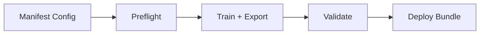
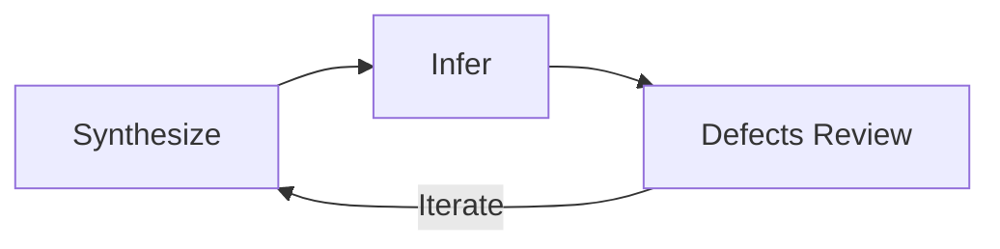

# 工业检测配方

=== "中文"

    本配方将工业快速路径和合成数据 MVP 循环结合为一套完整的端到端工作流。
    从清单配置出发，经过预检、训练导出、验证，最终得到可部署的检测 bundle。

=== "English"

    This recipe combines the Industrial Quick Path with the Synthetic Data MVP Loop
    into a complete end-to-end workflow. Starting from a manifest config, it walks through
    preflight, train+export, validation, and produces a deployable detection bundle.

---

## 工业快速路径 / Industrial Quick Path



### Step 1 — 清单配置 / Manifest Config

=== "中文"

    使用内置的工业均衡预设作为起点。该预设包含推荐的预处理、模型参数和阈值策略。

=== "English"

    Start with the built-in industrial balanced preset. It includes recommended
    preprocessing, model parameters, and thresholding strategy.

```json title="manifest_industrial_workflow_balanced.json"
{
  "dataset": {
    "root": "./data/my_product",
    "manifest": "manifest.jsonl",
    "image_size": [256, 256]
  },
  "model": "vision_resnet18_ecod",
  "preprocessing": {
    "pipeline": "industrial_light"
  },
  "training": {
    "epochs": 1,
    "batch_size": 32
  },
  "export": {
    "format": "onnx",
    "bundle": true
  }
}
```

### Step 2 — 预检 / Preflight

=== "中文"

    预检会验证清单格式、图像可读性、类别分布和磁盘空间。

=== "English"

    Preflight validates manifest format, image readability, class distribution, and disk space.

```bash
pyimgano-train preflight \
  --config manifest_industrial_workflow_balanced.json
```

!!! tip "预检清单 / Preflight Checklist"

    - 清单中 `normal` 样本 >= 20 张
    - 图像格式一致（推荐 PNG）
    - 无损坏或零字节文件
    - 标注掩码与图像分辨率匹配

### Step 3 — 训练 + 导出 / Train + Export

```bash
pyimgano-train fit \
  --config manifest_industrial_workflow_balanced.json \
  --export onnx \
  --bundle
```

=== "中文"

    训练完成后自动导出 ONNX 模型并打包为 deploy bundle。

=== "English"

    After training, the model is automatically exported to ONNX and packaged as a deploy bundle.

### Step 4 — 验证 / Validate

```bash
pyimgano-infer \
  --bundle ./output/bundle/ \
  --data ./data/my_product/test/ \
  --defects \
  --report
```

=== "中文"

    使用测试集运行推理，`--defects` 输出缺陷裁剪图，`--report` 生成汇总报告。

=== "English"

    Run inference on the test set. `--defects` outputs defect crops, `--report` generates a summary report.

### Step 5 — 部署 / Deploy

=== "中文"

    验证通过后，将 bundle 目录部署到目标设备即可。
    Bundle 包含模型权重、推理配置和预处理参数，自包含且可离线运行。

=== "English"

    Once validated, deploy the bundle directory to the target device.
    The bundle is self-contained with model weights, inference config, and preprocessing
    parameters, and runs fully offline.

---

## 合成数据 MVP 循环 / Synthetic Data MVP Loop

=== "中文"

    当缺陷样本不足或无法获取时，使用合成数据快速构建原型。

=== "English"

    When defect samples are scarce or unavailable, use synthetic data to quickly build prototypes.



### 合成 / Synthesize

```bash
# 从正常样本生成合成异常数据集
pyimgano-synthesize \
  --from-manifest manifest.jsonl \
  --output-dir ./synthetic/ \
  --presets scratch,stain,pit \
  --num-defects 2 \
  --severity-range 0.3 0.8 \
  --count 200
```

=== "中文"

    从正常图像清单出发，叠加多种缺陷预设，生成合成异常样本和对应掩码。

=== "English"

    Starting from a normal image manifest, overlay multiple defect presets to generate
    synthetic anomaly samples with corresponding masks.

### 推理 / Infer

```bash
pyimgano-infer \
  --model ssim_template_map \
  --data ./synthetic/ \
  --defects \
  --output-dir ./results/
```

### 缺陷审查 / Defects Review

=== "中文"

    检查 `--defects` 输出的裁剪图，确认模型能否检出合成缺陷。
    如果检出率低，调整合成参数（严重度、预设类型）后重新迭代。

=== "English"

    Review the defect crops from `--defects` output to verify that the model detects
    the synthetic defects. If recall is low, adjust synthesis parameters (severity, preset types)
    and re-iterate.

---

## 制品审查清单 / Artifact Review Checklist

=== "中文"

    每轮迭代结束后检查以下制品：

=== "English"

    Check the following artifacts after each iteration:

| 制品 / Artifact | 路径 / Path | 检查项 / Check |
|---|---|---|
| 训练日志 | `output/train.log` | 损失收敛、无 NaN |
| 导出模型 | `output/bundle/model.onnx` | 文件大小合理 |
| 推理配置 | `output/bundle/infer_config.json` | 阈值、预处理参数正确 |
| 缺陷裁剪 | `results/defects/` | 检出位置准确 |
| 掩码叠加 | `results/overlays/` | 掩码边界合理 |
| 合成样本 | `synthetic/` | 缺陷视觉逼真 |
